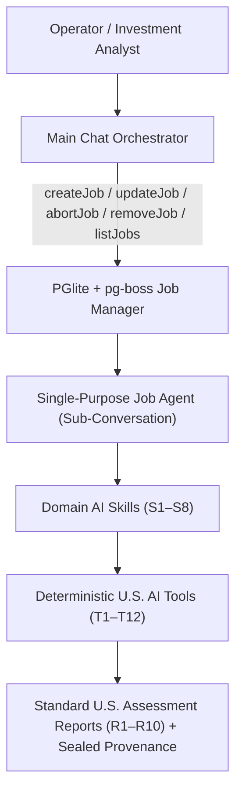

# U.S. Airport Investment Intelligence — AI Skills & AI Tools Specification

This specification breaks down the organized **U.S. Airport Modernization & Investment Intelligence** documentation (`airport-modernization-research-report.md`, `important-sources.md`, `airport-modernization-ecs-architecture.md`, and `airport-investment-intelligence-standard-assessment-report-templates.md`) into modular **AI Skills** and deterministic **AI Tools**.

---

## 1. Architecture Overview: Main Orchestrator vs. Single-Purpose Job Agents

To maintain **Single Responsibility (SOLID)** and strict epistemic governance, the AI architecture is separated into two tiers:

1. **Tier 1 — Main Chat Orchestrator (`VercelAiChatService`)**:
   - **Role**: Determines what single-purpose LLM jobs the operator wants to create, update, abort, remove, or inspect, and routinely synthesizes concise progress digests from active job sub-conversations.
   - **Tools (Job Management Only)**: `createJob`, `updateJob`, `abortJob`, `removeJob`, `listJobs`.
2. **Tier 2 — Single-Purpose Job Agents (`SinglePurposeLlmJobRunner`)**:
   - **Role**: Each job in `PGlite` + `pg-boss` is an independent LLM sub-conversation with a **single specific purpose** tied to an ECS Workflow (`W1–W7`), an ECS System, and a target U.S. NPIAS Airport (`JFK`, `LAX`, `ORD`, `DEN`, `ATL`, `DFW`, `DCA`, `SDF`, `GEG`, etc.).
   - **Equipped With**: The domain **AI Skill** (`S1–S8`) matching the job's workflow and its bound **AI Tools** (`T1–T12`) that execute deterministic U.S. financial, regulatory, queueing, delay-monetization, and emissions math.

---

## 2. Catalog of Domain AI Skills (`S1`–`S8`)

Each **AI Skill** encapsulates:
- **Domain Context & U.S. Statutory Guardrails** (system prompt instructions)
- **Target ECS Workflow (`W1–W7`) & ECS System**
- **Standard Report Templates Supported (`R1–R10`)**
- **Bound Executable AI Tools (`T1–T12`)**
- **Epistemic Verification Rules** (mandatory `Provenance` 1–5, Unofficial claim quarantine, GAO Confirmed-vs-Reported discipline)

| Skill ID | Skill Name | Workflow & ECS System | Reports Produced | Bound AI Tools |
|---|---|---|---|---|
| **S1** | `us-funding-capital-stack` | **W1** · `FundingSystem` | **R1**, **R2**, **R4**, **R9** | `queryUsAirportBaselineAndSources`, `computeCapitalStackAndGap`, `computeAipGrantAndPfcCapacity`, `computeCreditAndAirlineRates`, `evaluateGrantOutlayLifecycle`, `sealProvenanceAndGenerateReport` |
| **S2** | `capital-delivery-nepa-orat` | **W2** · `ProjectLifecycleSystem` | **R2**, **R3**, **R5**, **R6**, **R9** | `queryUsAirportBaselineAndSources`, `evaluateDemandTriggerAndBca`, `computeProjectEvmAndCsppWindow`, `evaluateAcrypOratReadinessGate`, `sealProvenanceAndGenerateReport` |
| **S3** | `passenger-flow-tsa-cbp` | **W3** · `PassengerFlowSystem` | **R6**, **R7**, **R10** | `queryUsAirportBaselineAndSources`, `computeErlangCQueueAndLaneTarget`, `sealProvenanceAndGenerateReport` |
| **S4** | `nas-bnatcs-airfield-cutover` | **W4** · `ATCDeploymentSystem` | **R3**, **R5**, **R10** | `queryUsAirportBaselineAndSources`, `computeBnatcsCutoverRiskAndDelaySavings`, `computeProjectEvmAndCsppWindow`, `sealProvenanceAndGenerateReport` |
| **S5** | `sustainability-vale-egrid` | **W5** · `SustainabilitySystem` | **R8**, **R9** | `queryUsAirportBaselineAndSources`, `computeEgridEmissionsAndGateElectrification`, `sealProvenanceAndGenerateReport` |
| **S6** | `infratech-maturity-roi` | **W6** · `MaturitySystem` | **R3**, **R7** | `queryUsAirportBaselineAndSources`, `evaluateInfratechMaturityAndRiskAdjustedNpv`, `sealProvenanceAndGenerateReport` |
| **S7** | `us-data-hub-cohort-benchmark` | **W7** · `IngestionSystem` / `BenchmarkSystem` | **R7**, **R9**, **R10** | `queryUsAirportBaselineAndSources`, `evaluateFeedHealthAndHubCohortBenchmark`, `sealProvenanceAndGenerateReport` |
| **S8** | `investment-report-synthesis` | **W1–W7** · `ViewProjectionSystem` | **R1–R10** (All) | All tools (`T1–T12`) for cross-cutting due diligence & executive report compilation |

---

### Detailed Skill Specifications

#### S1 — `us-funding-capital-stack` (U.S. Airport Funding, Bonds, P3 & Airline Rate-Making)
- **Triggering Workflow**: `W1` (`FundingSystem`)
- **Instructions & Statutory Rules**:
  1. Enforce **49 U.S.C. § 47109** statutory federal AIP shares: `75%` for Large/Medium Primary Hubs (`80%` for Part 150 noise), and `90%–95%` for Small Primary, Nonhub, Reliever, and GA airports.
  2. Enforce **14 CFR Part 158** PFC rules: statutory cap of `$4.50` per eligible enplaned passenger less `$0.11/pax` airline collection compensation (`$4.39` net at maximum rate).
  3. Account for the post-January 2026 sunset of the **$15B IIJA Airport Terminal Program (ATP)** by shifting unfunded terminal and ConRAC capital into **General Airport Revenue Bonds (GARBs)**, **Private Activity Bonds (PABs)**, **CFC Bonds**, **USDOT TIFIA loans**, and **DBFOM P3 concessions**.
  4. Apply the airport's specific **Airline Use & Lease Agreement (AULA)** rate-making regime (`Residual`, `Compensatory`, or `Hybrid`) from **FAA CATS Form 5100-127** and **MSRB EMMA** disclosures to compute **CPE**, **Senior/All-In DSCR** ($\ge 1.25\times$ / $1.10\times$), and **Unrestricted Days Cash on Hand (DCOH $\ge 365$ days)**.
  5. Enforce **FAA Grant Assurance #25 (Revenue Diversion Prohibition)** unless the transaction is structured under the **FAA Airport Investment Partnership Program (AIPP, 49 U.S.C. § 47134)**.

#### S2 — `capital-delivery-nepa-orat` (Capital Project Delivery, NEPA/CSPP & ACRP ORAT)
- **Triggering Workflow**: `W2` (`ProjectLifecycleSystem`)
- **Instructions & Statutory Rules**:
  1. Verify capacity expansion triggers against **FAA Terminal Area Forecast (TAF)** and **Annual Service Volume (ASV)** ($\text{Ops}/\text{ASV} \ge 0.60$ planning, $\ge 0.80$ construction).
  2. Require **NEPA environmental clearance** (`CATEX`, `EA/FONSI`, or `EIS/ROD` under FAA Order 1050.1F) and **FAA AC 150/5370-2G Construction Safety and Phasing Plan (CSPP)** approval before transitioning any initiative to `UnderConstruction`.
  3. Evaluate discretionary grant requests ($> \$10\text{M}$) using **OMB Circular A-94 Benefit-Cost Analysis (`NPV`, `BCR >= 1.0`)** and P3 concessions using **Loan Life Coverage Ratio (`LLCR >= 1.30x`)**.
  4. Track project execution via **Earned Value Management (`SPI`, `CPI`, `CSI`, composite `EAC`, `TCPI`)** and overnight closure window efficiency ($\eta$).
  5. Enforce the **TRB ACRP Report 164 ORAT Gate**: weighted readiness $R \ge 0.95$, zero critical defects, workforce training $\ge 98\%$, and mandatory sign-offs on **TSA PGDS**, **CBP ATDS**, **TSA Aviation Cybersecurity Directives**, **ADA Title II / ACAA (14 CFR Part 382)**, and **Climate/Power Resilience**.

#### S3 — `passenger-flow-tsa-cbp` (Passenger Journey, TSA Checkpoint & CBP FIS Queueing)
- **Triggering Workflow**: `W3` (`PassengerFlowSystem`)
- **Instructions & Statutory Rules**:
  1. Model passenger processing stages (Curbside, CUPPS Check-In, Biometric Self-Bag-Drop, TSA Standard/PreCheck Touchless ID Checkpoints, Boarding, and CBP Simplified Arrival FIS) using multi-server **Erlang-C ($M/M/c$)** queueing math.
  2. Evaluate stage stability ($\rho = \lambda/(c\mu) < 1$), probability of waiting $P_{\text{wait}}$, mean queue wait $W_q$, and **95th-percentile peak wait $W_{q95}$** against U.S. targets: Biometric Self-Bag-Drop $\le 70\text{ s}$ (OAG benchmark), TSA PreCheck Touchless ID $\le 5\text{ min}$, TSA Standard CT lane $\le 10\text{ min}$, and CBP FIS $\le 15\text{ min}$.
  3. Solve for the minimum required active lanes/kiosks $c^*$ to keep $W_{q95}$ within budget and verify mandatory **ADA/ACAA accessibility** and **CBP/TSA biometric opt-out signage**.

#### S4 — `nas-bnatcs-airfield-cutover` (NAS / BNATCS & Airfield Modernization Deployment)
- **Triggering Workflow**: `W4` (`ATCDeploymentSystem`)
- **Instructions & Statutory Rules**:
  1. Track site-level deployment of **FAA BNATCS** lots (612 radars, 27,625 radios, 462 digital voice switches, 5,170 telecom links, 44 airport surface radars, 200 Surface Awareness Initiative `SAI` sites, 89 Terminal Flight Data Manager `TFDM` sites, 435 tower EIDS, 113 tower simulators).
  2. Distinguish **GAO-26-107992 / FAA confirmed figures** ($12.5B appropriated July 2025, Dec 2028 Phase-1 target) from **secondary reported figures** (~$16B Phase-1 cost / ~$3.5B shortfall).
  3. Score overnight cutover windows using live **FAA SWIM** traffic exposure and rollback duration, and monetize **FAA ASPM** equipment-delay reductions using **USDOT Value of Travel Time Savings (`VTTS`)** and **Airline Direct Operating Cost per minute (`ADOM`)**.

#### S5 — `sustainability-vale-egrid` (U.S. Airport Sustainability, VALE/ZEV & Energy Transition)
- **Triggering Workflow**: `W5` (`SustainabilitySystem`)
- **Instructions & Statutory Rules**:
  1. Compute Scope 1 and Scope 2 emissions using official **U.S. EPA `eGRID`** subregional power factors (e.g., `RMPA` for DEN, `CAMX` for LAX/SFO, `NYC/NYUP` for JFK/LGA, `RFCW` for ORD, `SRSO` for ATL, `SRMW` for SDF).
  2. Quantify gate electrification (400Hz GPU + Preconditioned Air) APU fuel-burn displacement using **FAA AEDT / VALE** technical parameters ($327M FAA gate electrification grant program + **FAA Airport ZEV** fleet program).
  3. Evaluate geothermal HVAC retrofits (e.g., Louisville `SDF` $>80\%$ HVAC emissions cut) and solar + battery microgrid **Energy-as-a-Service (EaaS) P3s** against Net-Zero linear glidepaths and Compound Annual Reduction Rates (**CARR**).

#### S6 — `infratech-maturity-roi` (Smart-Tech Adoption & Infratech ROI Governance)
- **Triggering Workflow**: `W6` (`MaturitySystem`)
- **Instructions & Statutory Rules**:
  1. Score airport infratech maturity ($0\text{–}4$) across five dimensions (`ai_flow`, `predictive_maintenance`, `digital_twin`, `biometrics`, `data_platform`) using **only primary operational evidence** (`Credibility >= 4`).
  2. Quarantine consultancy and vendor claims (such as McKinsey's "6–8% EBITDA uplift" or vendor blog adoption claims) as **Unofficial** (`Credibility <= 3`); never include them in base-case underwriting cash flows.
  3. Enforce the `DataReadinessHold` guard when underlying AODB/SWIM/sensor integration is below level 2, and compute risk-adjusted Infratech `NPV` and discounted payback.

#### S7 — `us-data-hub-cohort-benchmark` (U.S. Realtime Data Hub & FAA Hub Cohort Benchmarking)
- **Triggering Workflow**: `W7` (`IngestionSystem` / `BenchmarkSystem`)
- **Instructions & Statutory Rules**:
  1. Monitor feed staleness ($S = t_{\text{now}} - t_{\text{last}} > 2 \times \text{SLA} \Rightarrow \text{Degraded}$) and completeness ($C < 0.95 \Rightarrow \text{Alert}$) across U.S. realtime (`FAA SWIM`, `NOTAM`, `AviationWeather`, `AeroAPI`, `OpenSky`, `CBP Wait Times`) and batch (`FAA CATS 5100-127`, `MSRB EMMA`, `ASPM`, `TAF`, `BTS TranStats`) sources.
  2. Segment peer benchmarks strictly by **FAA Statutory Hub Classification** (`Large Hub`, `Medium Hub`, `Small Hub`) and compute both standard z-scores ($z$) and outlier-resistant **robust IQR z-scores ($z_{\text{IQR}}$)**.

#### S8 — `investment-report-synthesis` (Standard U.S. Assessment Reports R1–R10 Generator)
- **Triggering Workflow**: Cross-cutting (`W1–W7` $\to$ `ViewProjectionSystem`)
- **Instructions & Statutory Rules**:
  1. Synthesize verified tool outputs into any of the ten Standard U.S. Assessment Report Templates (**R1–R10**).
  2. Attach a complete `Provenance` block to every quantitative section, propagate composite confidence as $\min(\text{input credibilities})$, include the reproducible formula appendix, and quarantine any `Unofficial` inputs.

---

## 3. Catalog of Executable AI Tools (`T1`–`T12`)

Every AI Tool is implemented in `/src/server/ai/tools-registry.ts` using the Vercel AI SDK `tool()` helper with strict Zod input/output schemas and deterministic domain math:

| Tool ID | Tool Name | Bound Skills | Mathematical / Domain Operation |
|---|---|---|---|
| **T1** | `queryUsAirportBaselineAndSources` | S1–S8 | Retrieves U.S. NPIAS/Core 30 airport profile (`FAA LID`, `HubClass`, `RateRegime`, Form 5100-127 `CPE`/`NARE`/`DSCR`/`DCOH`/`HHI`, `ASV`, `eGRID` subregion) and authoritative U.S. source citations. |
| **T2** | `computeCapitalStackAndGap` | S1, S8 | Computes 5-year capital stack (`AIP + IIJA_AIG_ATP + PFC + CFC + GARB + P3 + TIFIA + Cash`), net unfunded `Gap`, and P3/Bond share %. |
| **T3** | `computeAipGrantAndPfcCapacity` | S1, S8 | Computes 49 U.S.C. § 47109 AIP federal share ($s$), sponsor match, 14 CFR Part 158 net annual PFC revenue ($r_{\text{PFC}} - \$0.11$), and max PFC bond principal. |
| **T4** | `computeCreditAndAirlineRates` | S1, S8 | Computes Senior & All-In `DSCR`, `Residual` vs. `Compensatory` `CPE`, Landing Fee ($/1,000 lbs), Terminal Rental Rate ($/sq ft), and `DCOH`. |
| **T5** | `evaluateGrantOutlayLifecycle` | S1, S8 | Computes grant Outlay Ratio (`OR = outlays / obligated`), checks 18-month stall guard (`OR < 0.50`), and emits next `FundingInstrument.Lifecycle` state. |
| **T6** | `evaluateDemandTriggerAndBca` | S2, S8 | Computes FAA `TAF / ASV` delay trigger ($0.60 / 0.80 / 1.00$), OMB Circular A-94 `NPV` & `BCR`, and P3 `LLCR` ($\ge 1.30\times$). |
| **T7** | `computeProjectEvmAndCsppWindow` | S2, S4, S8 | Computes `SPI`, `CPI`, `CSI`, composite `EAC`, `TCPI`, `SV`, and FAA AC 150/5370-2G overnight closure window efficiency ($\eta$). |
| **T8** | `evaluateAcrypOratReadinessGate` | S2, S8 | Computes weighted ACRP 164 ORAT readiness $R \ge 0.95$, checks `CriticalDefects == 0`, staff coverage $\ge 0.98$, and U.S. statutory gates (`TSA PGDS`, `CBP ATDS`, `TSA Cyber`, `ADA/ACAA`, `Climate`). |
| **T9** | `computeErlangCQueueAndLaneTarget` | S3, S8 | Computes exact multi-server **Erlang-C ($M/M/c$)** utilization $\rho$, wait probability $P_{\text{wait}}$, mean wait $W_q$, **95th-percentile wait $W_{q95}$**, and optimal lane count $c^*$. |
| **T10** | `computeBnatcsCutoverRiskAndDelaySavings` | S4, S8 | Computes BNATCS lot progress $P$, cutover window risk score, ASPM equipment delay reduction $\Delta D$, and annual dollar savings (`USDOT VTTS + ADOM`). |
| **T11** | `computeEgridEmissionsAndGateElectrification` | S5, S8 | Computes Scope 1+2 emissions (`EPA eGRID`), FAA `VALE`/`AEDT` gate electrification APU displacement ($\Delta E_{\text{Gate}}$), Net-Zero glidepath, `CARR`, and grant leverage. |
| **T12** | `evaluateInfratechAndCohortBenchmark` | S6, S7, S8 | Computes credibility-weighted Infratech maturity ($0\text{–}4$) & risk-adjusted `NPV`, feed staleness/completeness ($S, C$), FAA Hub Cohort standard/robust z-scores ($z, z_{\text{IQR}}$), and generates sealed **R1–R10** report sections. |
