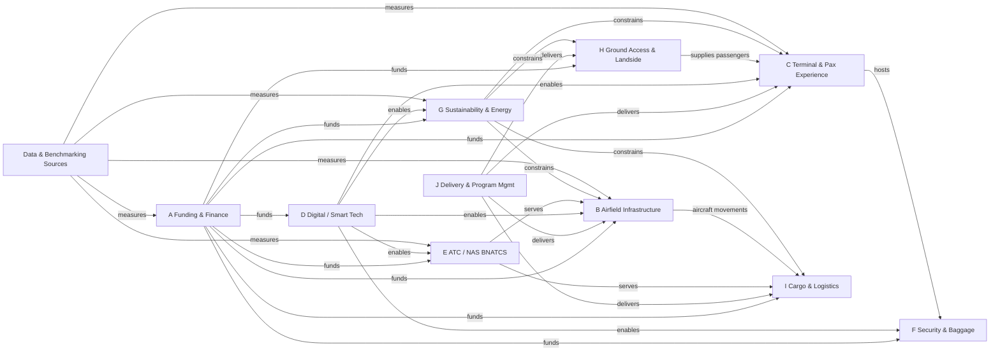
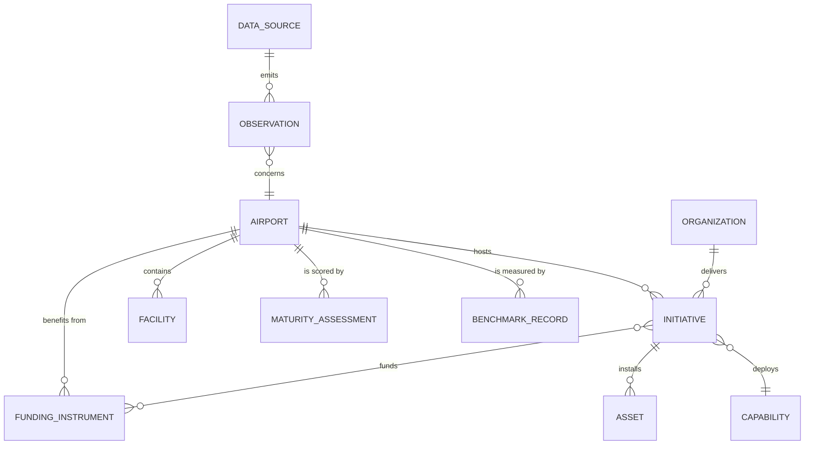

# Airport Modernization — ECS Architecture

This document turns the airport-modernization research into a working information architecture: the relations between the ten feature categories, the workflows those relations imply, an ECS (Entity-Component-System) model that powers the workflows, revised workflows after comparing required views against what real documentation offers, the data object schemas, the consolidated core schema, and the view registry (each view ships as an MDX file in the companion **View Pack** canvas).

## 1. Relation Model — Categories and Features

The ten feature categories from the research report (A–J) do not operate independently. The relation model below defines the six relation types that connect them; every workflow in §5 is a traversal of one or more of these relations.



| Relation type | From → To | Meaning | Concrete example |
|---|---|---|---|
| `funds` | A → {B…I} | Capital supply. Financial instruments pay for feature build-outs. | AIP grants cover 75–95% of eligible airfield costs; IIJA ATP ~$15B for terminals; P3/municipal bonds post-2026. |
| `delivers` | J → {B, C, H, I} | Delivery model governs execution. | Design-build (Spokane parking), prime-integrator contract (BNATCS/Peraton), PPP (India brownfield airports). |
| `enables` | D → {C, F, B, G, E} | Digital capability unlocks other categories. | Biometrics enable 70-second self-bag-drop (C); predictive maintenance enables airfield uptime (B); AI flow management (E). |
| `serves` | E → {B, I} | NAS services consume airfield surfaces and serve aircraft. | 44 airports get replacement surface radars; 200 get Surface Awareness Initiative; 89 get Terminal Flight Data Manager. |
| `constrains` | G → {B, C, H, I} | Sustainability targets impose design budgets on physical work. | Net-zero 2040 (Denver), electrified gate equipment ($327M FAA), embodied-carbon benchmarks (IATA). |
| `supplies/hosts` | H → C, C → F | Passenger flow dependency chain (landside → terminal → security). | LAX's ground-transportation-first $30B program feeds terminal demand. |
| `measures` | X → {A, B, C, E, G} | Data sources quantify all categories (the compilation intent). | ACI traffic dataset (2,817 airports), ASQ (707k pax surveys), Cirium OTP, NPIAS costs, GAO BNATCS status. |

**Feature-level relations** (examples the workflows traverse): `AIP grant` —funds→ `taxiway reconfiguration` (B); `biometric identity` (D) —enables→ `self-bag-drop` (C) and `baggage anti-fraud matching` (F, unofficial); `electrification grant` (A/G) —constrains→ `gate equipment refresh` (C); `prime-integrator contract` (J) —delivers→ `digital voice switches` (E).

## 2. Realtime Data Source Catalog (Global Airports)

Compiled for the compilation intent: getting realtime data on airports worldwide. Cadence classes: **RT** (sub-minute), **NRT** (minutes–hours), **BATCH** (daily+).

| # | Source | Coverage | Data | Cadence | Access |
|---|---|---|---|---|---|
| 1 | [FAA SWIM](https://www.faa.gov/air_traffic/technology/swim) (incl. [SFDPS flight data](https://www.faa.gov/air_traffic/technology/swim/sfdps)) | US NAS | Flight plans, en-route/terminal traffic, surveillance, weather, NOTAMs | RT | Subscription to FAA SWIM feeds |
| 2 | [FAA NOTAM Search](https://notams.aim.faa.gov/notamSearch/) / SWIM NOTAM feed | US + worldwide | NOTAMs (runway closures, construction) | RT | Free web / feed |
| 3 | [AviationWeather.gov Data API](https://aviationweather.gov/data/api/) | Global | METAR, TAF, PIREP | RT | Free REST |
| 4 | [OpenSky Network API](https://opensky-network.org/data/api) | Global | Live ADS-B positions, velocity, callsign | RT (~5–10 s) | Free (research), paid tiers |
| 5 | [ADS-B Exchange](https://www.adsbexchange.com/) | Global | Unfiltered ADS-B, including military/GA | RT | Free feed / commercial |
| 6 | [Flightradar24 API](https://fr24api.flightradar24.com/) | Global | Live positions, airline & airport info, history | RT | Commercial API |
| 7 | [FlightAware AeroAPI / Firehose](https://www.flightaware.com/commercial/aeroapi/) | Global | Live flight status, positions, predictive ETAs, airport delays | RT | Commercial API |
| 8 | [AirLabs](https://airlabs.co/) | Global | Live flight tracker, airport schedules, routes, airline data | RT/NRT | Freemium API |
| 9 | [Aviationstack](https://aviationstack.com/) | Global | Live flight status by airport/flight | RT/NRT | Freemium API |
| 10 | [Aviation Edge](https://aviation-edge.com/) (incl. [NOTAM API](https://aviation-edge.com/notam-api/)) | Global | Flights, schedules, NOTAM, airport DB | RT/NRT | Freemium API |
| 11 | [EUROCONTROL Network Manager](https://www.eurocontrol.int/network-manager) / DDR | Europe | ATFM delays, traffic flow, routes | RT ops / post-ops | Licensing |
| 12 | Airport operator APIs (e.g., LAX, Heathrow flight status feeds) | Per airport | Arrivals/departures, terminal/gate assignments | RT | Public/commercial |
| 13 | [CheckWX](https://www.checkwxapi.com/) / [AVWX](https://info.avwx.rest/) | Global | Parsed METAR/TAF | RT | Freemium API |
| 14 | [BTS TranStats](https://www.transtats.bts.gov/data_elements.aspx) | US | Enplanements, on-time, fares | BATCH | Free |
| 15 | [ACI World Airport Traffic Dataset](https://aci.aero/resources/data-center/) | Global (2,817 airports) | Passenger/cargo/movement totals & rankings | BATCH | Purchase (public rankings free) |
| 16 | [Cirium OTP](https://www.cirium.com/resources/on-time-performance/) / OAG | Global | On-time performance, schedules | BATCH (monthly) | Commercial |
| 17 | [OurAirports](https://ourairports.com/data/) | Global | Static airport reference data (codes, coordinates, types) | BATCH | Free open data |

**Usage note (feeds W7):** realtime sources (1–13) answer "what is happening at these airports now"; batch sources (14–17) answer "how do they compare over time." Airport-level entity resolution runs on IATA/ICAO codes; ADS-B-derived feeds are aircraft-level and must be aggregated per airport (arrival/departure counts, delay accumulation).

## 3. ECS Core Model

The domain is modeled as **entities** (IDs) that carry **components** (plain data) and are transformed by **systems** (pure functions over component sets). Workflows are orchestrations of system runs with state transitions recorded as `StateEntry` components.

### 3.1 Entities

| Entity | Key | Examples from source material |
|---|---|---|
| `Airport` | ICAO/IATA | JFK, DWC, DEN, DEL |
| `Organization` | org id | FAA, PANYNJ, ACI World, AAI, Peraton |
| `Facility` | airport + facility id | Terminal 1 (DCA), runway 22L, TRACON, cargo terminal |
| `Initiative` | initiative id | JFK New Terminal One, BNATCS Phase 1, Denver gate electrification, Delhi biometric bag-drop pilot |
| `FundingInstrument` | instrument id | AIP-2025 grant, ATP NOFO award, PFC authority, airport revenue bond, PPP concession |
| `Asset` | asset id | radar, radio, digital voice switch, self-bag-drop unit, e-gate, EV bus, geothermal HVAC plant |
| `Capability` | capability id | Biometric boarding, AI flow management, predictive maintenance, digital twin |
| `DataSource` | source id | FAA SWIM SFDPS, OpenSky API, ACI dataset, Cirium OTP |
| `Observation` | observation id | "DEL T3 avg bag-drop time 71 s @ 2026-10-05T08:00Z" |
| `BenchmarkRecord` | benchmark id | ASQ score, OTP rank, emissions-per-pax percentile |
| `Actor` | actor id | Grant officer, program manager, terminal ops director, sustainability lead, data engineer |

### 3.2 Components (data, no logic)

| Component | Fields (abbrev.) | Used by |
|---|---|---|
| `Identification` | codes {iata, icao}, name, aliases | all entities |
| `Geo` | lat/lon, country, region, tz | Airport, Facility |
| `Classification` | categoryTags A–J, featureFlags {official/unofficial/gap} | Initiative, Capability, Asset |
| `Financials` | budget, committed, spent, currency, fiscalYear | Initiative, FundingInstrument |
| `Schedule` | plannedStart/End, milestones[], variance | Initiative |
| `Lifecycle` | state, substate, entries[] (StateEntry log) | Initiative, FundingInstrument, DataSource, Capability |
| `RiskProfile` | level, factors[], mitigations[] | Initiative, Asset, DataSource |
| `SustainabilityProfile` | baselineYear, tCO2e, targets[], energyMix | Airport, Initiative |
| `Throughput` | pax/hr, bags/hr, movements/hr, stageTimes | Facility, Capability |
| `EquipmentSpec` | kind, model, count, installState | Asset |
| `MaturityScore` | dimension, score 0–4, evidence, asOf | Capability, Airport |
| `FeedConfig` | endpoint, protocol, cadence, latencySLA, auth, fieldMap | DataSource |
| `BenchmarkData` | metric, cohort, value, rank, percentile, asOf | BenchmarkRecord |
| `RelationSet` | relations[{type, targetId, weight}] | all entities |
| `Provenance` | sources[{url, credibility 1–5, retrievedAt}], confidence, asOf | all entities |

### 3.3 Systems

| System | Runs on | Responsibility |
|---|---|---|
| `RelationResolverSystem` | `RelationSet`, `Identification` | Maintains category/feature relations; entity resolution on airport codes |
| `FundingSystem` | `Financials`, `Lifecycle` (FundingInstrument) | Grant lifecycle transitions, drawdown math, funding-gap calc |
| `ProjectLifecycleSystem` | `Schedule`, `Lifecycle`, `Financials` (Initiative) | Stage gates, EVM, ORAT readiness |
| `PassengerFlowSystem` | `Throughput` (Facility, Capability) | Stage-time budgets, queue math, rollout gates |
| `ATCDeploymentSystem` | `EquipmentSpec`, `Lifecycle` (Asset, Initiative) | BNATCS site deployment, cutover windows, delay attribution |
| `SustainabilitySystem` | `SustainabilityProfile` | Emissions accounting, glidepath tracking |
| `MaturitySystem` | `MaturityScore` | Infratech maturity scoring, pilot gates |
| `IngestionSystem` | `FeedConfig` (DataSource) | Connect, validate, dedupe, quarantine |
| `NormalizationSystem` | `Observation` | Unit/code normalization, airport aggregation of aircraft-level feeds |
| `BenchmarkSystem` | `BenchmarkData` | Cohort statistics, percentile/z-score |
| `AlertSystem` | any component | Threshold breaches (budget, schedule, staleness, queue time) |
| `ViewProjectionSystem` | projections of components | Builds view models consumed by the MDX views (V1–V7) |

## 4. Workflow Catalog (identified from the relations)

| # | Workflow | Traverses relations | Primary actors | System | View |
|---|---|---|---|---|---|
| W1 | Funding & Grant Lifecycle | funds; measures | Sponsor CFO, FAA grants officer | FundingSystem | V1 |
| W2 | Capital Project Delivery & ORAT | delivers; funds | Program manager, contractor, ORAT team | ProjectLifecycleSystem | V2 |
| W3 | Passenger Journey Modernization | supplies/hosts; enables | Terminal ops, TSA/airlines, tech vendor | PassengerFlowSystem | V3 |
| W4 | ATC & Airfield Modernization Deployment | serves; enables; delivers | FAA program office, integrator, controllers | ATCDeploymentSystem | V4 |
| W5 | Sustainability & Energy Transition | constrains; funds | Sustainability lead, facilities, FAA | SustainabilitySystem | V5 |
| W6 | Smart-Tech Adoption (maturity) | enables; measures | CIO/innovation office | MaturitySystem | V6 |
| W7 | Realtime Data Compilation & Benchmarking | measures | Data engineer, analyst | Ingestion/Normalization/Benchmark | V7 |

## 5. Views Analysis — Needed vs. Actual Documentation

### 5.1 What the actual documentation provides today

| Source (actual doc) | View form it offers | What's missing for workflow support |
|---|---|---|
| FAA AIP grant lists (2025/2026) | Static tables: grant, airport, amount | No lifecycle state, no grant↔project↔airport linkage, no drawdown progress |
| NPIAS report + appendices | PDF tables: airport, role, 5-yr cost estimate | No deltas between editions, no drill-down, no funding-gap math shown |
| BNATCS fact sheet | Aggregate counts (612 radars, 27,625 radios…) | No per-site status, no cutover calendar, no delay-reduction tracking |
| GAO-26-107992 | Snapshot status figures | Point-in-time; no trend, no alerting |
| ACI World rankings | Annual press tables | Not live; no per-airport time series without purchasing the dataset |
| Operator portals (PANYNJ builds) | Marketing-style project pages | No KPIs, no EVM, no open data |
| Cirium/OAG OTP reports | Monthly PDFs | Batch only; no airport drill-down without license |
| OAG/Regula/vendor tech pieces | Prose claims | No verifiable adoption metrics (unofficial) |

### 5.2 Views the workflows need (and why the documentation can't serve them)

- **Live state**, not snapshots → workflows need entity `Lifecycle` states that update from events (grant obligations, milestone completions, feed heartbeats).
- **Cross-entity drill-down** → a funding view must pivot to projects, then to the airport, then to realtime observations.
- **Variance computation** → docs state plans; workflows need plan-vs-actual (EVM, emissions glidepath, deployment progress).
- **Gap fills** → the research flagged features absent from documentation (cybersecurity, accessibility, resilience, cargo digitization). The revised workflows add explicit actions and view slots for them so the compiled documentation covers the field completely.

### 5.3 Workflow revisions arising from this comparison

1. **W1/W2 revised**: added a *state-sync ingestion* action (documentation is static; grants and milestones must be ingested/updated as events) and a *RelationResolver* step linking grant → initiative → airport (absent in FAA tables).
2. **W2 revised**: added `CyberResilienceCheck` and `ClimateResilienceCheck` actions to the commissioning gate, and `AccessibilityAudit` to terminal commissioning — filling documented gaps.
3. **W3 revised**: added a *baseline-ingestion* action (queue times from realtime feeds rather than manual surveys) and an accessibility conformance check at gate review.
4. **W4 revised**: added delay-attribution measurement (FAA fact sheet cites 300% higher equipment-related delay minutes vs 2010–2024 baseline; the workflow now tracks this) and per-site status beyond aggregate fact-sheet counts.
5. **W6 revised**: added `DataReadinessHold` state and evidence requirements, because maturity claims are largely unofficial vendor statements; pilots must attach primary measurements (ASQ, queue-time deltas).
6. **W7 added (new)**: no actual documentation supplies realtime data; this workflow operationalizes the §2 catalog into feeds, validation, normalization, benchmarking, and alerting.
7. **All workflows**: every terminal state now emits a `Provenance` update so every compiled fact traces to a source with a credibility score.

## 6. Workflow Specifications

Each workflow defines: actors, flow steps, actions, formulas, and a state transition table (columns: current state; event; guard; action; next state). All states are values of the entity's `Lifecycle.state`; every transition appends a `StateEntry`.

### 6.1 W1 — Funding & Grant Lifecycle

**Purpose:** move an airport's infrastructure need from identification to a funded, executed, closed financial instrument. **Actors:** sponsor CFO (airport), FAA grants officer, underwriter, advocate. **Entities:** `FundingInstrument`, `Initiative`, `Airport`. **System:** FundingSystem. **View:** V1.

**Flow**
1. Need aggregation — NPIAS 5-year development cost estimates + ACI-NA Infrastructure Needs Study are ingested per airport.
2. Instrument selection matrix — airfield/safety → AIP; terminals → ATP grant, PFC, bonds; megaprograms → P3/PPP; match to category A features.
3. Application — AIP grant application or ATP NOFO response; sponsor share computed.
4. Award & obligation — FAA obligation recorded; event emitted to W2 (`Initiative.funded`).
5. Active drawdown — reimbursements against incurred costs; outlay rate tracked.
6. Closeout — final report; single audit; provenance sealed.

**Formulas**
- Funding gap: `Gap = TotalNeed − Σ(FundedInstruments)` where `TotalNeed` = NPIAS estimate + ACI-NA needs.
- AIP share: `s = 0.75` (large/medium primary hub), `s = 0.80` (noise programs), `s ∈ [0.90, 0.95]` (small primary, reliever, GA). Sponsor share `= Cost × (1 − s)`.
- PFC capacity: `PFC_annual = enplanements × PFC_rate` (capped; ACI-NA advocates lifting the cap).
- Outlay rate: `OR = cumulativeOutlays / obligatedAmount`.
- Debt service coverage: `DSCR = netRevenues / annualDebtService` (bond viability, target ≥ 1.25).

**State transition table — FundingInstrument.Lifecycle**

| Current | Event | Guard | Action | Next |
|---|---|---|---|---|
| `Identified` | `NeedRegistered(airport, costEstimate)` | airport in NPIAS or needs study | create instrument; link to Initiative | `InstrumentSelected` |
| `InstrumentSelected` | `ApplicationSubmitted(type)` | sponsor share funded | compute sponsor share; attach provenance | `Applied` |
| `Applied` | `AwardDecision(granted)` | eligibility verified | record obligation amount; emit `Funded` to linked Initiative | `Awarded` |
| `Applied` | `AwardDecision(denied)` | — | emit `FundingHold` to Initiative | `Rejected` |
| `Awarded` | `ObligationExecuted(amount, fy)` | appropriation available | set `Financials.committed` | `Obligated` |
| `Obligated` | `FirstDrawdown(invoice)` | costs incurred & eligible | compute OR baseline | `DrawdownActive` |
| `DrawdownActive` | `ProgressPayment(invoice)` | OR ≤ 1.0; audit clean | update spent; recompute OR; alert if OR stalls | `DrawdownActive` |
| `DrawdownActive` | `FinalPayment()` | deliverables accepted | closeout report draft | `CloseoutPending` |
| `CloseoutPending` | `AuditComplete(clean)` | single audit passed | seal provenance; archive | `Closed` |
| `CloseoutPending` | `AuditFinding(issue)` | — | remediation plan | `AuditHold` |
| `AuditHold` | `RemediationAccepted()` | finding resolved | seal provenance | `Closed` |
| `DrawdownActive` | `Stalled(months > 18)` | no outlays | alert; re-plan with Initiative | `Stalled` |
| `Stalled` | `ReactivationApproved()` | re-justified | resume drawdown | `DrawdownActive` |

PFC variant states: `Authorized → Collecting → ProjectLinked → Sunset` (PFC collections restricted to FAA-approved projects).

### 6.2 W2 — Capital Project Delivery & ORAT

**Purpose:** execute a modernization initiative from master plan to steady-state operations. **Actors:** program manager, design/build firm, integrator, ORAT team, airport ops. **Entities:** `Initiative`, `Facility`, `Asset`, `FundingInstrument`. **System:** ProjectLifecycleSystem. **View:** V2.

**Flow**
1. Master plan (IATA ADRM) — capacity demand triggers.
2. Business case & funding (consumes W1 output).
3. Design.
4. Procurement — delivery model per category J (design-build, P3, prime integrator).
5. Construction — with live-operations risk management (runway/taxiway closure windows per FAA construction impact practice; overnight opportunistic closures).
6. Commissioning & ORAT (IATA ORAT best practice) — including gap-filled checks: cyber resilience, climate resilience, accessibility.
7. Operational steady state; handover to ops; benchmark intake begins.

**Formulas**
- Demand trigger: `Trigger = forecastPax / designCapacity ≥ threshold` (start expansion planning).
- EVM: `SPI = EV / PV`, `CPI = EV / AC`, `EAC = BAC / CPI`, `SV = EV − PV`.
- ORAT readiness: `R = passedTests / totalTests`; gate at `R ≥ 0.95` with zero critical defects.
- Construction window efficiency: `η = workHours / (closureHours × crewSize)`; plan closures in low-impact windows.
- Utilization headroom post-delivery: `headroom = 1 − forecastPeakPax / designCapacity`.

**State transition table — Initiative.Lifecycle (kind: capital)**

| Current | Event | Guard | Action | Next |
|---|---|---|---|---|
| `Planned` | `FundingSecured(instrumentIds)` | gap closed (W1) | link instruments; baseline BAC, PV curve | `Funded` |
| `Planned` | `FundingDenied()` | — | explore alternative instruments; ACI-NA advocacy item | `FundingHold` |
| `FundingHold` | `AlternativeFundingApproved()` | P3/bond approved | re-baseline | `Funded` |
| `Funded` | `DesignComplete()` | ADRM conformity | freeze scope; issue procurement | `Procuring` |
| `Procuring` | `ContractAwarded(deliveryModel)` | evaluation done | set delivery model; risk register init | `UnderConstruction` |
| `UnderConstruction` | `MilestoneReached(m)` | — | recompute EV, SPI, CPI; alert if SPI < 0.9 | `UnderConstruction` |
| `UnderConstruction` | `WorkStoppage(cause)` | — | delay log; re-baseline with variance report | `ConstructionHold` |
| `ConstructionHold` | `ResumeApproved()` | cause cleared | update schedule variance | `UnderConstruction` |
| `UnderConstruction` | `ConstructionComplete()` | inspections passed | begin commissioning; start ORAT tests | `Commissioning` |
| `Commissioning` | `ORATGate(R ≥ 0.95)` | cyber + climate resilience checks passed; accessibility audit passed (gap-fill) | emit readiness certificate | `Operational` |
| `Commissioning` | `ORATGate(failed)` | critical defects | defect backlog | `Commissioning` |
| any construction state | `Cancelled(approval)` | sponsor + funder sign-off | clawback per instrument rules | `Cancelled` |

### 6.3 W3 — Passenger Journey Modernization

**Purpose:** reduce end-to-end journey time and raise satisfaction by modernizing the stage chain kerbside → check-in → bag drop → security → gate → boarding → border (categories H→C→D→F). **Actors:** terminal ops director, airline, TSA/CBP, tech vendor. **Entities:** `Facility` (stage), `Capability`, `Observation`. **System:** PassengerFlowSystem. **View:** V3.

**Flow**
1. Baseline — ingest realtime stage times & queue lengths (revised: from feeds, not manual surveys).
2. Bottleneck diagnosis — rank stages by wait/service time.
3. Tech selection — kiosks, self-bag-drop, biometric boarding, e-gates (D enabling C/F).
4. Pilot at one terminal — instrumented with Observation metrics.
5. Evaluation gate — KPI deltas vs baseline.
6. Scale across terminals; live monitoring; continuous optimization.

**Formulas**
- Journey time: `T = Σᵢ tᵢ` over stages; stage budget table (e.g., bag drop ≤ 70 s with biometric photo-matching per OAG data).
- Little's Law: `L = λ · W` (avg queue length = arrival rate × avg wait).
- Checkpoint throughput (M/M/c approximation): utilization `ρ = λ / (cμ)`, stable if `ρ < 1`; expected wait `Wq ≈ Lq / λ`.
- Bag-drop gain: `Δt = t_manual − t_sbd` (≈30% per OAG); new stage capacity `μ' = 1 / t_sbd`.
- Biometric adoption: `A = biometricPax / totalPax` per stage.
- Satisfaction link: correlate stage times to ACI ASQ scores (`BenchmarkSystem`).

**State transition table — Capability.Lifecycle (kind: processing tech)**

| Current | Event | Guard | Action | Next |
|---|---|---|---|---|
| `BaselineSet` | `BottleneckConfirmed(stage)` | baseline ≥ 30 days observations | rank bottlenecks; shortlist tech | `Designed` |
| `Designed` | `PilotApproved(terminal)` | budget ≤ envelope | deploy to pilot terminal; instrument metrics | `Piloting` |
| `Piloting` | `PilotComplete()` | ≥ 90 days data | compute ΔT, ΔWq, ASQ delta | `Evaluating` |
| `Evaluating` | `GatePass(deltas ≥ thresholds)` | e.g., Δ stage time ≥ 20%; accessibility conformance check passed (gap-fill) | approve scale-up plan | `Scaling` |
| `Evaluating` | `GateFail()` | — | post-mortem; vendor re-engagement | `PilotFailed` |
| `Scaling` | `AllTerminalsLive()` | training complete | switch to live monitoring | `Live` |
| `Live` | `DriftDetected(metric)` | alert threshold breach | optimization loop (rebalance lanes/staff via AI flow mgmt) | `Optimizing` |
| `Optimizing` | `MetricsStabilized()` | within budget | return | `Live` |
| `PilotFailed` | `RetireDecision()` | — | decommission; archive learnings | `Retired` |
| any | `RollbackTriggered(safety/privacy)` | incident guard | revert to manual process | `RolledBack` |

### 6.4 W4 — ATC & Airfield Modernization Deployment

**Purpose:** deploy BNATCS-class equipment and airfield works site-by-site while keeping the NAS running. **Actors:** FAA program office, prime integrator, airport ops, controllers. **Entities:** `Asset`, `Initiative` (deployment), `Facility` (tower/TRACON/airport surface). **System:** ATCDeploymentSystem. **View:** V4.

**Flow**
1. National allocation — equipment lots (612 radars, 27,625 radios, 462 voice switches, 5,170 network connections…) mapped to sites (44 airports get surface radar; 200 get Surface Awareness Initiative; 89 get Terminal Flight Data Manager; 435 towers get EIDS; 113 get tower simulators; 1 new ARTCC; 1 new TRACON; Alaska: 110 weather stations, 64 cameras).
2. Site survey & readiness (telecom/fiber first per FAA priority).
3. Installation.
4. Integration & test.
5. Cut-over in low-traffic windows (aligned with airfield construction closure scheduling).
6. Verification — delay-attribution tracking.
7. Steady state.

**Formulas**
- Deployment progress: `P = sitesDelivered / sitesPlanned` by equipment class and nationally.
- Delay-attribution: equipment-related delay minutes 2025 ran ~300% above the 2010–2024 average (FAA); target trajectory `D(t) = D_base × (1 − k·P)` with fitted attribution factor `k`.
- Cutover risk: `Risk = complexityScore × trafficExposure(hours) × rollbackDuration`.
- Window efficiency: `η = equipmentInstalled / (closureHours × crewSize)`; overnight/low-configuration windows preferred per FAA construction impact reports.
- NAS availability during transition: `A = uptime / scheduledOpsHours`, alert at SLA breach.

**State transition table — Asset.Lifecycle (kind: ATC equipment)**

| Current | Event | Guard | Action | Next |
|---|---|---|---|---|
| `Allocated` | `SiteSurveyPassed(site)` | fiber/network ready | schedule install window | `Surveyed` |
| `Surveyed` | `Installed()` | installation complete | register EquipmentSpec | `Installed` |
| `Installed` | `IntegrationTested()` | interfaces pass | schedule cutover window | `CutoverReady` |
| `CutoverReady` | `WindowOpened(lowTraffic)` | risk ≤ threshold; rollback plan staged | execute cut-over | `CutoverComplete` |
| `CutoverComplete` | `VerificationPassed()` | 30-day fault-free | record delay-attribution baseline delta | `SteadyState` |
| `CutoverComplete` | `DefectFound(severity)` | critical | auto-rollback plan | `RolledBack` |
| `RolledBack` | `FixVerified()` | — | reschedule window | `CutoverReady` |
| `SteadyState` | `PerformanceDrift(metric)` | SLA breach | maintenance ticket; predictive-maintenance hook (D) | `Maintaining` |
| `Maintaining` | `ServiceRestored()` | SLA met | close ticket | `SteadyState` |
| `Installed` | `IntegrationFailed()` | — | defect log; re-test | `DefectHold` |
| `DefectHold` | `FixAccepted()` | integrator sign-off | re-run integration tests | `CutoverReady` |

### 6.5 W5 — Sustainability & Energy Transition

**Purpose:** move an airport from unassessed to a measured, on-track net-zero trajectory (G constraining B/C/H/I). **Actors:** sustainability lead, facilities, FAA grant office, energy vendors. **Entities:** `Airport`, `Initiative` (kind: sustainability), `Asset` (EV, HVAC, charger). **System:** SustainabilitySystem. **View:** V5.

**Flow**
1. Baseline audit — Scope 1 + 2 inventory; energy intensity.
2. Target setting — net-zero dates (Denver 2040; industry 2050; ZEV fleets by 2030 at Heathrow).
3. Portfolio selection — gate electrification (FAA $327M programs), ZEV ground fleets, geothermal HVAC (Louisville, >80% emission cut), on-airport solar/microgrids (gap-fill), embodied-carbon benchmarks via IATA tools.
4. Implementation (often through W2 delivery).
5. Measurement & verification — periodic inventories, benchmark intake (ACI environmental benchmarking).
6. Reporting & glidepath tracking.

**Formulas**
- Emissions inventory: `E = Σ(fuelᵢ × EFᵢ) + electricity × gridEF` (Scope 1 + 2, tCO2e).
- Fleet electrification: `ZEV% = ZEV_count / fleetTotal` (e.g., Heathrow 17% → 100% by 2030).
- Reduction vs baseline: `r = (E_t − E_base) / E_base`.
- Glidepath (linear): `annualΔ = (E_t − E_target) / yearsRemaining`; status = `OnTrack` if `E_t ≤ glidepath(E_t)`.
- Energy intensity: `kWh / passenger`; embodied carbon `kgCO2e / m²` for new builds (IATA benchmarking tools).
- Grant leverage: `Leverage = totalProgramCost / federalGrant` (e.g., $327M electrification grants de-risking larger programs).

**State transition table — Airport.SustainabilityProfile.Lifecycle**

| Current | Event | Guard | Action | Next |
|---|---|---|---|---|
| `Unassessed` | `BaselineAuditCompleted(inventory)` | 12-month data | set baseline year; compute kWh/pax | `BaselineSet` |
| `BaselineSet` | `TargetsAdopted(netZeroYear)` | board/authority approval | define glidepath; interim targets | `Targeted` |
| `Targeted` | `PortfolioApproved(initiatives)` | funding linked (W1) | register initiatives; embodied-carbon checks on builds | `Implementing` |
| `Implementing` | `InitiativeOperational()` | verified install | recompute E, ZEV%, kWh/pax | `Implementing` |
| `Implementing` | `MilestoneInventory(t)` | inventory cycle due | compare to glidepath | `Verifying` |
| `Verifying` | `OnGlidepath()` | E_t ≤ glidepath | publish; feed V5; ACI benchmark intake | `OnTrack` |
| `Verifying` | `OffGlidepath()` | E_t > glidepath | root-cause; accelerate portfolio; alert | `OffTrack` |
| `OffTrack` | `CorrectionPlanApproved()` | resources committed | re-baseline initiatives | `Implementing` |
| `OnTrack` | `NetZeroVerified()` | independent verification | seal provenance | `NetZeroAchieved` |

### 6.6 W6 — Smart-Tech Adoption (Digital Maturity)

**Purpose:** move infratech capabilities from pilot purgatory to embedded operations, with evidence discipline (most claims in the field are unofficial). **Actors:** CIO/innovation office, ops, vendor. **Entities:** `Capability`, `Airport`, `Observation`. **System:** MaturitySystem. **View:** V6.

**Flow**
1. Maturity assessment across dimensions (AI flow management, predictive maintenance, digital twins, biometrics, data platform) scored 0–4 (McKinsey benchmark framing).
2. Gap analysis vs peer cohort.
3. Pilot selection — with data-readiness prerequisite (revision).
4. Instrumented pilot — primary metrics only (queue deltas, downtime avoided).
5. Gate review — thresholds + evidence requirements (ASQ, sensor data), not vendor claims.
6. Scale → embed in runbooks; capability registry update.

**Formulas**
- Composite maturity: `M = Σ wᵢ·sᵢ / Σ wᵢ`, sᵢ ∈ [0,4].
- Cohort gap: `z = (M_airport − μ_cohort) / σ_cohort`.
- Pilot gate: ΔKPI ≥ threshold (e.g., unplanned downtime −20% for predictive maintenance; queue time −15% for AI flow management).
- Payback: `P = capex / annualBenefit`; McKinsey's 6–8% EBITDA uplift is a **consultancy estimate** — flagged unofficial, used only as aspiration, never as evidence.
- Adoption: `A(t) = 1 − e^(−kt)` fitted from deployment telemetry.

**State transition table — Capability.Lifecycle (kind: infratech)**

| Current | Event | Guard | Action | Next |
|---|---|---|---|---|
| `Assessed` | `GapAnalysisDone(cohort)` | benchmark data available | rank gaps; candidate pilots | `GapAnalyzed` |
| `GapAnalyzed` | `PilotApproved(businessCase)` | data platform readiness (revision) | register pilot; success metrics & thresholds | `PilotApproved` |
| `PilotApproved` | `PilotStarted()` | instrumentation live | collect primary Observations | `Piloting` |
| `Piloting` | `GateReview(held)` | thresholds met with primary evidence | approve scale plan | `Scaled` |
| `Piloting` | `GateReview(failed)` | — | post-mortem; vendor evidence request | `PilotFailed` |
| `Scaled` | `EmbeddedInRunbooks()` | training done | update maturity score; registry | `Embedded` |
| `Embedded` | `DriftDetected()` | KPI regression | re-enter optimization | `Piloting` (optimization) |
| `PilotApproved` | `DataReadinessBlocked()` | platform absent | remediate data platform first | `DataReadinessHold` |
| `DataReadinessHold` | `PlatformReady()` | — | resume | `Piloting` |
| `PilotFailed` | `RetireDecision()` | — | decommission; archive learnings | `Retired` |

### 6.7 W7 — Realtime Data Compilation & Benchmarking

**Purpose:** operationalize the §2 catalog into live feeds per airport, normalize them, benchmark, and project views. This workflow exists because no actual documentation is realtime. **Actors:** data engineer, analyst, all view consumers. **Entities:** `DataSource`, `Observation`, `BenchmarkRecord`, `Airport`. **Systems:** Ingestion, Normalization, Benchmark, Alert. **View:** V7.

**Flow**
1. Source catalog registration — per §2, with cadence class (RT/NRT/BATCH), credibility weight (1–5).
2. Connector provisioning — protocol, auth, field mapping (FeedConfig).
3. Streaming ingestion — events → Observations.
4. Validation — schema check, freshness, dedupe; quarantine on failure.
5. Normalization — airport entity resolution (IATA/ICAO/local codes; OurAirports reference), unit conversion, aircraft→airport aggregation (ADS-B feeds).
6. Storage & benchmarking — cohort statistics, percentile ranks.
7. Projection — build view models for V1–V7; alerting on thresholds.

**Formulas**
- Staleness: `S = now − lastEventTs`; breach when `S > 2 × cadenceSLA` → `Degraded`.
- Completeness: `C = receivedRecords / expectedRecords` per window; alert `C < 0.95`.
- Dedupe key: `(sourceId, externalId, eventTs)`.
- Airport aggregation of aircraft feeds: `movements(airport, hour) = count distinct flights with status event at airport`.
- Percentile rank: `p = |{x′ ∈ cohort : x′ < x}| / n`; z-score `z = (x − μ)/σ`.
- Composite index: `I = Σ wⱼ · norm(metricⱼ)` where `wⱼ` = source credibility weight.
- Confidence propagation: `confidence(airportFact) = min(source confidences)` combined across contributing sources.

**State transition table — DataSource.Lifecycle**

| Current | Event | Guard | Action | Next |
|---|---|---|---|---|
| `Registered` | `ConnectorProvisioned()` | credentials valid | test pull; field map verify | `Connected` |
| `Connected` | `FirstEventReceived()` | schema passes | begin streaming; start freshness timer | `Streaming` |
| `Streaming` | `StalenessBreach()` | S > 2 × SLA | alert; probe endpoint | `Degraded` |
| `Degraded` | `EventsResumed()` | schema still valid | backfill gap; clear alert | `Streaming` |
| `Streaming` | `SchemaViolation(batch)` | field map mismatch | quarantine batch; notify owner | `Quarantined` |
| `Quarantined` | `FieldMapFixed()` | replay passes | replay quarantined batches | `Streaming` |
| `Streaming` | `AuthExpired()` | — | credentials refresh request | `Suspended` |
| `Suspended` | `CredentialsRenewed()` | — | re-test connection | `Connected` |
| `Streaming` | `ContractEnded()` | license expiry | archive; find replacement source | `Retired` |

## 7. Data Object Schemas

Schemas are TypeScript-shaped (portable to JSON Schema). `?` = optional; enums shown inline.

### 7.1 Shared primitives

```ts
type ISODate = string;                 // "2026-10-05"
type ISOTimestamp = string;            // "2026-10-05T08:15:00Z"
type Credibility = 1 | 2 | 3 | 4 | 5;

interface AirportCode { iata?: string; icao?: string; local?: string; }
interface Monetary { amount: number; currency: string; asOf?: ISODate; }
interface GeoPoint { lat: number; lon: number; elevationM?: number; country: string; region?: string; tz: string; }
interface SourceCitation { sourceId: string; url: string; credibility: Credibility; retrievedAt: ISODate; }
interface Provenance { sources: SourceCitation[]; confidence: Credibility; asOf: ISODate; }
type CategoryTag = "A_FUNDING" | "B_AIRFIELD" | "C_TERMINAL_PAX" | "D_DIGITAL"
  | "E_ATC_NAS" | "F_SECURITY_BAGGAGE" | "G_SUSTAINABILITY" | "H_GROUND_ACCESS"
  | "I_CARGO" | "J_DELIVERY" | "X_DATA";
type FeatureStatus = "official" | "unofficial" | "gap";
interface StateEntry { from: string; to: string; event: string; at: ISOTimestamp; actor: string; note?: string; }
interface Lifecycle { state: string; substate?: string; entries: StateEntry[]; }
interface Relation { type: "funds"|"delivers"|"enables"|"serves"|"constrains"|"supplies"|"hosts"|"measures"; targetId: string; weight?: number; }
```

### 7.2 Per-workflow objects

```ts
// W1 — Funding
interface FundingInstrument {
  id: string; kind: "aip_grant" | "atp_grant" | "pfc" | "revenue_bond" | "p3_concession" | "state_program";
  airportId: string; initiativeIds: string[];
  need: Monetary; award?: Monetary; obligated?: Monetary; spent: Monetary;
  share?: { sponsorPct: number; federalPct: number };
  outlayRate?: number; dscr?: number;
  lifecycle: Lifecycle; provenance: Provenance;
}

// W2 — Capital delivery
interface Initiative {
  id: string; kind: "capital" | "atc_deployment" | "sustainability" | "tech_pilot";
  name: string; airportId: string; facilityIds: string[];
  categories: CategoryTag[]; features: { feature: string; status: FeatureStatus }[];
  bac: Monetary; ev: Monetary; ac: Monetary; pv: Monetary;            // EVM fields
  spi?: number; cpi?: number; eac?: Monetary;
  oratReadiness?: number;                                              // 0..1
  deliveryModel: "design_bid_build" | "design_build" | "p3" | "prime_integrator" | "ppp";
  schedule: { plannedStart: ISODate; plannedEnd: ISODate; milestones: Milestone[] };
  risk: { level: "low"|"med"|"high"; factors: string[]; mitigations: string[] };
  lifecycle: Lifecycle; provenance: Provenance;
}
interface Milestone { name: string; due: ISODate; actual?: ISODate; pv: Monetary; ev: Monetary; }

// W3 — Passenger flow
interface ProcessStage {
  id: string; facilityId: string; name: string;                   // e.g., "bag_drop"
  timeBudgetSec?: number; observed: Observation[];                // linked realtime metrics
  queueModel: { arrivalRatePaxPerMin: number; servers: number; serviceRatePerMin: number; rho: number };
  techCapabilityIds: string[];
  accessibility: { audited: boolean; conformances: string[] };    // gap-fill
}
interface TechDeployment { id: string; stageId: string; capabilityId: string; adoptionPct: number; }

// W4 — ATC deployment
interface DeploymentTask {                                         // = Initiative kind atc_deployment, plus:
  equipmentClass: "radar"|"radio"|"voice_switch"|"network"|"surface_surveillance"|"tfdm"|"eids"|"simulator"|"weather"|"facility";
  siteId: string; lotId: string; cutoverWindow?: { start: ISOTimestamp; end: ISOTimestamp; riskScore: number };
  delayAttribution?: { baselineMin: number; currentMin: number };
}
interface EquipmentLot { id: string; class: string; nationalTotal: number; delivered: number; plannedSites: number; }

// W5 — Sustainability
interface EmissionsInventory { airportId: string; year: number; scope1_tCO2e: number; scope2_tCO2e: number;
  gridEF: number; energyKWh: number; pax: number; energyPerPax: number; }
interface SustainabilityTarget { airportId: string; netZeroYear: number; baselineYear: number;
  interim: { year: number; tCO2e: number }[]; zevFleetPct: number; zevTargetPct: number; }

// W6 — Maturity
interface MaturityAssessment { airportId: string; asOf: ISODate;
  dimensions: { name: "ai_flow"|"predictive_maintenance"|"digital_twin"|"biometrics"|"data_platform"; score: 0|1|2|3|4; evidence: string[] }[];
  composite: number; cohortZ?: number; }
interface PilotRecord { id: string; capabilityId: string; airportId: string;
  kpis: { metric: string; baseline: number; pilot: number; thresholdPct: number; passed: boolean }[];
  capex: Monetary; annualBenefit: Monetary; paybackYears?: number; }

// W7 — Data
interface DataSource {
  id: string; name: string; coverage: string; cadence: "rt" | "nrt" | "batch";
  protocol: "rest" | "websocket" | "feed" | "file"; endpoint: string; latencySlaSec?: number;
  fieldMap: Record<string, string>; credibility: Credibility;
  lifecycle: Lifecycle; provenance: Provenance;
}
interface Observation {
  id: string; sourceId: string; airportId?: string; facilityId?: string; subjectId: string;
  metricKey: string; ts: ISOTimestamp; value: number; unit: string;
  quality: "validated" | "quarantined" | "estimated"; dedupeKey: string;
}
interface BenchmarkRecord {
  id: string; airportId: string; metricKey: string; cohort: string; value: number;
  rank?: number; percentile?: number; zScore?: number; asOf: ISODate; provenance: Provenance;
}
interface Alert { id: string; scope: string; kind: "budget"|"schedule"|"staleness"|"queue"|"emissions"|"maturity";
  severity: "info"|"warn"|"critical"; raisedAt: ISOTimestamp; resolvedAt?: ISOTimestamp; detail: string; }
```

## 8. Schema Consolidation

Four consolidations remove duplication across the seven schemas:

1. **`Initiative` is the single execution object.** `Initiative` (W2), `DeploymentTask` (W4), sustainability portfolio items (W5), and `PilotRecord`/`TechDeployment` (W3/W6) all share identity, schedule, money, lifecycle, risk, provenance, and relations. They consolidate into one `Initiative` with `kind` and a discriminated `spec` union:

```ts
type InitiativeSpec =
  | { kind: "capital"; oratReadiness: number; deliveryModel: Initiative["deliveryModel"]; milestonePlan: Milestone[] }
  | { kind: "atc_deployment"; equipmentClass: DeploymentTask["equipmentClass"]; lotId: string;
      cutoverWindow: DeploymentTask["cutoverWindow"]; delayAttribution: DeploymentTask["delayAttribution"] }
  | { kind: "sustainability"; targetId: string; emissionsImpact_tCO2e: number }
  | { kind: "tech_pilot"; stageId: string; kpis: PilotRecord["kpis"]; capex: Monetary; annualBenefit: Monetary };
```

2. **`Observation` is the single measurement envelope.** Stage times (W3), delay minutes (W4), emissions/energy readings (W5), and feed health metrics (W7) all become `Observation` rows distinguished by `metricKey` from a governed metric catalog (metric key, unit, cadence, aggregation rule). `BenchmarkRecord` is a projection of `Observation` sets and keeps only cohort statistics.

3. **`FundingInstrument` is the single money object.** AIP grant, ATP grant, PFC, bond, P3, and state program collapse into `kind` + shared `Financials`/`Lifecycle`; PFC-specific fields (rate, enplanements, collection projection) move into an optional `pfc` block rather than a separate type.

4. **`StateEntry`/`Lifecycle`/`Provenance` are universal.** Every state table in §6 appends the same `StateEntry`; every object carries the same `Provenance` — so "compiled documentation" means: every fact in the system traces to a source with a credibility score and a retrieval date, including the unofficial/gap feature flags from the research report.

**Consolidated entity graph (core):**



## 9. View Registry (MDX views)

Seven views, one per workflow, shipped as MDX files in the companion canvas **"Airport Modernization — ECS View Pack (MDX)"**. Each view declares which workflow actions it supports, its KPI cards, its primary table, state chips for the workflow's state machine, formulas used, and loading/empty/error states.

| View | File (in View Pack) | Serves workflow | Primary jobs |
|---|---|---|---|
| V1 Funding & Portfolio | `v1-funding-portfolio.mdx` | W1 (feeds W2) | Funding gap, instrument portfolio table with lifecycle chips, drawdown/outlay, DSCR, PFC capacity |
| V2 Project Lifecycle Tracker | `v2-project-tracker.mdx` | W2 | Stage-gate board, EVM (SPI/CPI/EAC), ORAT gate checklist incl. gap-filled checks, risk register |
| V3 Passenger Journey Ops | `v3-passenger-journey.mdx` | W3 | Journey-time budget vs observed per stage, queue math (Little's Law), tech adoption %, accessibility conformance |
| V4 ATC & Airfield Tracker | `v4-atc-airfield.mdx` | W4 | National equipment lots progress, per-site status, cutover calendar, delay-attribution trend |
| V5 Sustainability Dashboard | `v5-sustainability.mdx` | W5 | Emissions vs glidepath, ZEV fleet %, energy intensity, portfolio of initiatives, embodied carbon |
| V6 Technology Maturity Radar | `v6-maturity-radar.mdx` | W6 | Dimension radar (0–4), cohort z-scores, pilot gates with evidence status, payback |
| V7 Realtime Data Hub | `v7-data-hub.mdx` | W7 | Source catalog (§2) with health chips, airport search/drill-down, benchmark rankings, alert feed |

## 10. Open Items

1. **Per-airport instantiation**: the schemas are airport-agnostic; fixing a concrete airport list (e.g., US Core 30 + top 20 global hubs) would allow seeding data from the research canvas and the §2 feeds.
2. **Metric catalog governance**: the `metricKey` registry (stage times, delay minutes, tCO2e, kWh/pax, ASQ) needs an owner and versioning.
3. **MDX component library**: the views import a small `ui.mdx` component set (`StatCard`, `DataTable`, `StateChip`, `StateTable`, `Callout`, `Formula`, `MetricRadar`, `Sparkline`) — a stub of it is included in the View Pack and should be implemented once in the target docs framework.
4. **Unofficial-feature quarantine**: `FeatureStatus = "unofficial"` facts (vendor claims) should never drive alerts — only render with an Unofficial chip in views.