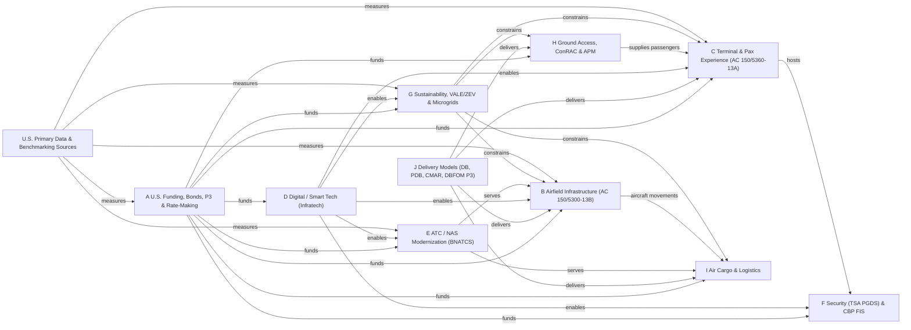

# U.S. Airport Modernization & Investment Intelligence — ECS Architecture

This document defines the working Entity-Component-System (ECS) architecture, workflow state machines, financial/operational algorithms, data schemas, and view registry for a **U.S. Airport Modernization Consultation & Investment Intelligence Platform**. All non-U.S. entities and foreign regulatory frameworks have been removed, and all seven workflows (W1–W7) have been refined with institutional-grade U.S. municipal finance, FAA/TSA/CBP regulatory compliance, and operations-research calculations.

---

## 1. Relation Model — U.S. Categories and Features

The ten U.S. modernization feature categories (A–J) interact through seven typed relations. Every workflow in §6 is a formal traversal of these relations.



| Relation Type | From → To | Meaning | U.S. Concrete Example |
|---|---|---|---|
| `funds` | A → {B…I} | Capital stack & rate recovery pay for physical/digital build-outs. | FAA AIP grants cover 75%–95% of eligible airfield costs; IIJA ATP ($15B), PFCs ($4.50 cap), GARBs, PABs, CFCs, and TIFIA loans fund terminals & ConRACs. |
| `delivers` | J → {B, C, H, I} | Delivery model & NEPA/CSPP governance control execution. | DBFOM P3 ($9.5B JFK New Terminal One, LGA Terminal B, LAX APM/ConRAC), Progressive Design-Build (GEG, DEN), Prime Integrator (BNATCS/Peraton). |
| `enables` | D → {C, F, B, G, E} | Digital capability unlocks throughput, uptime, or energy savings. | TSA Touchless ID & biometric bag drop (~70 s budget) enable terminal/checkpoint capacity (C/F); BHS predictive maintenance cuts downtime (F); TFDM aids surface flow (E). |
| `serves` | E → {B, I} | NAS equipment & ATC procedures serve airfield surfaces and cargo hubs. | 44 U.S. airports receive replacement surface radars; 200 receive Surface Awareness Initiative (SAI); 89 receive Terminal Flight Data Manager (TFDM). |
| `constrains` | G → {B, C, H, I} | NEPA, EPA eGRID, and Net-Zero targets impose design/emissions budgets. | DEN Net-Zero 2040, FAA $327M + VALE/ZEV gate electrification, SDF geothermal HVAC (>80% facility emissions cut), JFK NTO 11.3 MW solar microgrid. |
| `supplies/hosts` | H → C, C → F | Landside-to-airside passenger processing chain. | LAX $30B ground-access-first program (APM + ConRAC) feeds terminal check-in (C) and TSA PGDS checkpoints / CBP FIS (F). |
| `measures` | X → {A, B, C, E, G} | Primary U.S. databases quantify financials, operations, and compliance. | FAA CATS Form 5100-127, MSRB EMMA, FAA NPIAS, FAA TAF, FAA ASPM/OPSNET, FAA ADIP/5010, BTS TranStats, EPA eGRID, GAO-26-107992. |

---

## 2. U.S. Realtime & Primary Data Source Catalog

Compiled for U.S. airport investment and operational intelligence. Cadence classes: **RT** (sub-minute), **NRT** (minutes–hours), **BATCH** (daily/monthly/annual).

| # | Source | Coverage | Data Provided | Cadence | Credibility |
|---|---|---|---|---|---|
| 1 | [FAA SWIM (SFDPS, TFMS, STDDS)](https://www.faa.gov/air_traffic/technology/swim) | U.S. NAS | Flight plans, terminal surface movement (ASDE-X/ASSC), traffic flow management | RT | 5/5 |
| 2 | [FAA NOTAM Search / SWIM NOTAM Feed](https://notams.aim.faa.gov/notamSearch/) | U.S. NAS | Active runway/taxiway closures, NAVAID outages, AC 150/5370-2G construction windows | RT | 5/5 |
| 3 | [AviationWeather.gov Data API](https://aviationweather.gov/data/api/) ([CheckWX](https://www.checkwxapi.com/), [AVWX](https://info.avwx.rest/)) | U.S. / NOAA | Official METAR, TAF, PIREP, wind/visibility conditions | RT | 5/5 |
| 4 | [FlightAware AeroAPI / Firehose](https://www.flightaware.com/commercial/aeroapi/) | U.S. NAS | Live flight status, ADS-B positions, predictive ETAs, airport delay indices | RT | 4/5 |
| 5 | [OpenSky Network API](https://opensky-network.org/data/api) / [ADS-B Exchange](https://www.adsbexchange.com/) | U.S. NAS | Live ADS-B state vectors, surface/airborne velocity, callsign | RT (~5–10 s) | 4/5 |
| 6 | [CBP Airport Wait Times (`awt.cbp.gov`)](https://awt.cbp.gov/) | U.S. International Gateways | Federal Inspection Services (FIS) passport control wait times & open booths | NRT (Hourly) | 5/5 |
| 7 | U.S. Airport Operator Live Telemetry APIs (PANYNJ, LAWA, DEN, DFW, ATL, MCO) | Per U.S. Hub | TSA security wait times, gate/terminal assignments, ConRAC/parking occupancy | RT/NRT | 4/5 |
| 8 | [FAA CATS (Form 5100-127 & 5100-126)](https://cats.airports.faa.gov/) | All U.S. Commercial Airports | Audited operating revenues, O&M expenses, debt service, CPE, DCOH, PFC collections | BATCH (Annual) | 5/5 |
| 9 | [MSRB EMMA](https://emma.msrb.org/) | U.S. Municipal Issuers | Official Statements, Consultant Feasibility Reports, GARB/PFC/CFC/PAB DSCR covenants | BATCH (Event/Annual) | 5/5 |
| 10 | [FAA NPIAS](https://www.faa.gov/airports/planning_capacity/npias) & [AIP/ATP Grant Lists](https://www.faa.gov/airports/aip/2026_aip_grants) | ~3,300 U.S. Airports | Hub classification, 5-year eligible capital needs, federal grant awards & outlays | BATCH | 5/5 |
| 11 | [FAA ASPM & OPSNET](https://aspm.faa.gov/) | U.S. Core 30 & ASPM 77 | Cause-specific NAS delay minutes, unimpeded taxi times, hourly AAR/ADR capacity | BATCH (Daily/Monthly) | 5/5 |
| 12 | [FAA Terminal Area Forecast (TAF)](https://taf.faa.gov/) | U.S. NPIAS Airports | Official 20-year enplanement and aircraft operations projections | BATCH (Annual) | 5/5 |
| 13 | [FAA ADIP / Form 5010 Master Record](https://adip.faa.gov/) | U.S. NPIAS Airports | Runway/taxiway geometry, Pavement Condition Index (PCI), eALP | BATCH | 5/5 |
| 14 | [BTS TranStats (T-100, DB1B)](https://www.transtats.bts.gov/data_elements.aspx) | U.S. Commercial Airports | Enplanements, carrier market share (HHI), O&D %, average fares | BATCH (Monthly/Qtr) | 5/5 |
| 15 | [U.S. EPA eGRID](https://www.epa.gov/egrid) & [FAA AEDT](https://aedt.faa.gov/) | U.S. Power Grids & Airports | Sub-regional electricity emission factors (`lb CO2e/MWh`) and aircraft/APU emissions | BATCH (Annual) | 5/5 |
| 16 | [ACI-NA Benchmarking](https://airportscouncil.org/) & [ACI ASQ](https://aci.aero/programs-and-services/asq/) / [Cirium OTP](https://www.cirium.com/resources/on-time-performance/) | U.S. / North American Cohorts | Needs study ($173.9B), passenger satisfaction scores, OTP percentiles | BATCH (Qtr/Annual) | 4/5 |

---

## 3. ECS Core Model

The domain is modeled as **entities** (IDs) that carry **components** (structured state) and are transformed by **systems** (pure domain calculations and state transitions).

### 3.1 Entities (U.S. Domain Examples)

| Entity | Primary Key | U.S. Examples |
|---|---|---|
| `Airport` | FAA LID / ICAO / IATA | `JFK` (`KJFK`), `LAX` (`KLAX`), `ORD` (`KORD`), `DEN` (`KDEN`), `ATL` (`KATL`), `DFW` (`KDFW`), `DCA` (`KDCA`), `SDF` (`KSDF`), `GEG` (`KGEG`), `SJU` (`TJSJ`) |
| `Organization` | `orgId` | FAA, PANYNJ, LAWA, CDA, MWAA, ACI-NA, Peraton, Ferrovial/JFK NTO Consortium, Moody's/S&P |
| `Facility` | `airportId + facilityId` | JFK New Terminal One, DCA Terminal 1, DEN Concourse B East, KORD Runway 9C/27C, LAX ConRAC, NY TRACON (N90) |
| `Initiative` | `initiativeId` | JFK New Terminal One P3 ($9.5B), BNATCS Phase 1 ($12.5B), DEN Gate Electrification, ATL Touchless ID Biometric Checkpoint, SDF Geothermal HVAC |
| `FundingInstrument` | `instrumentId` | `AIP-2026-KORD`, `ATP-FY26-KDCA`, `PFC-KORD-07`, `GARB-PANYNJ-2030`, `PAB-JFKNTO-2026`, `TIFIA-LAX-CONRAC` |
| `Asset` | `assetId` | ASR-11 replacement radar, BNATCS digital voice switch, TSA CT-80 scanner, 400Hz gate GPU/PCA, biometric self-bag-drop kiosk |
| `Capability` | `capabilityId` | TSA PreCheck Touchless ID, CBP Simplified Arrival, AI dynamic lane allocation, BHS predictive maintenance, eALP digital twin |
| `DataSource` | `sourceId` | FAA SWIM SFDPS, FAA CATS 5100-127, MSRB EMMA, FAA ASPM, FAA TAF, BTS T-100, CBP Wait Times API |
| `Observation` | `observationId` | `"KATL T-South TSA PreCheck Touchless ID wait 195 s @ 2026-10-06T14:00Z"` |
| `BenchmarkRecord` | `benchmarkId` | U.S. Large Hub CPE percentile, ASPM OTP rank, EPA eGRID Scope 2 kgCO2e/pax z-score |
| `Actor` | `actorId` | Airport CFO, Municipal Bond Underwriter, P3 Concessionaire, FAA ADO Engineer, ORAT Director, TSA Federal Security Director |

### 3.2 Components

| Component | Key Fields | Attached To |
|---|---|---|
| `Identification` | `iata`, `icao`, `faaLid`, `name`, `faaRegion`, `hubClass` (`large_hub` \| `medium_hub` \| `small_hub` \| `nonhub` \| `reliever` \| `ga`) | `Airport`, `Facility` |
| `GovernanceProfile` | `sponsorType` (`authority` \| `municipality` \| `county` \| `state` \| `aipp_p3`), `rateRegime` (`residual` \| `compensatory` \| `hybrid`), `miiThresholdPct`, `aulaExpirationYear` | `Airport` |
| `Classification` | `categoryTags` (`A`–`J`), `featureStatus` (`official` \| `unofficial` \| `gap`), `nepaClass` (`catex` \| `ea_fonsi` \| `eis_rod`) | `Initiative`, `Capability`, `Asset` |
| `Financials` | `budget`, `obligated`, `outlays`, `cpe`, `nare`, `dscrSenior`, `dscrAllIn`, `dcohDays`, `llcr`, `hhiCarrierShare` | `Airport`, `Initiative`, `FundingInstrument` |
| `Schedule` | `plannedStart`, `plannedEnd`, `milestones[]`, `varianceDays`, `csppApproved` | `Initiative` |
| `Lifecycle` | `state`, `substate`, `entries[]` (`StateEntry` audit log) | `Initiative`, `FundingInstrument`, `DataSource`, `Capability`, `Asset` |
| `RiskProfile` | `level`, `factors[]`, `mitigations[]`, `tsaCyberCompliant`, `climateResiliencePassed`, `adaAcaaPassed` | `Initiative`, `Asset`, `DataSource` |
| `SustainabilityProfile` | `baselineYear`, `scope1_tCO2e`, `scope2_tCO2e`, `egridSubregion`, `egridRateLbMWh`, `zevFleetPct`, `valeGrantActive` | `Airport`, `Initiative` |
| `Throughput` | `paxPerHr`, `bagsPerHr`, `aar`, `adr`, `asv`, `stageTimesSec`, `erlangC` | `Facility`, `Capability` |
| `MaturityScore` | `dimension`, `score` (`0..4`), `primaryEvidenceUrls[]`, `asOf` | `Capability`, `Airport` |
| `Provenance` | `sources[{sourceId, url, credibility 1..5, retrievedAt}]`, `confidence`, `asOf` | All entities |

---

## 4. Workflow Catalog (U.S. Investment & Consultation Lifecycle)

| Code | Workflow Name | Primary U.S. Actors | ECS System | MDX View | Standard Reports Produced |
|---|---|---|---|---|---|
| **W1** | U.S. Funding, Capital Stack & Rate-Making Lifecycle | Airport CFO, Municipal Underwriter, FAA ADO, P3 Investor | `FundingSystem` | `V1` | **R1** (Needs & Gap), **R2** (CIP), **R4** (AIP/ATP Grant), **R9** (P3/Credit DD) |
| **W2** | Capital Project Delivery, NEPA/CSPP & ACRP ORAT | Program Manager, DB/P3 Contractor, ORAT Team, TSA/CBP | `ProjectLifecycleSystem` | `V2` | **R2** (CIP), **R3** (Feasibility/BCA), **R5** (Monthly EVM), **R6** (ORAT), **R9** |
| **W3** | Passenger Journey, TSA Checkpoint & CBP FIS Flow | Terminal Ops Director, TSA FSD, CBP Port Director, Airlines | `PassengerFlowSystem` | `V3` | **R6** (ORAT Throughput), **R7** (Benchmarking), **R10** (Ops Brief) |
| **W4** | NAS / BNATCS & Airfield Modernization Deployment | FAA Program Office, Prime Integrator (Peraton), NATCA/Ops | `ATCDeploymentSystem` | `V4` | **R5** (Cutover Impact), **R10** (Daily NAS Brief) |
| **W5** | Sustainability, VALE/ZEV & Energy Transition | Sustainability Officer, MEP/Microgrid EaaS Provider, FAA | `SustainabilitySystem` | `V5` | **R8** (Sustainability & Net-Zero), **R9** (ESG Due Diligence) |
| **W6** | Smart-Tech Adoption & Infratech ROI Governance | Airport CIO, Innovation Office, Operations Directors | `MaturitySystem` | `V6` | **R3** (Tech Business Case), **R7** (Tech Maturity Benchmark) |
| **W7** | U.S. Realtime Data Compilation & Hub Cohort Benchmarking | Data Engineer, Investment Analyst, Duty Officer | `Ingestion / BenchmarkSystem` | `V7` | **R7** (Cohort Benchmarking), **R9** (Market DD), **R10** (Situational Brief) |

---

## 5. Documentation Gaps Identified & Architectural Resolutions

| # | Gap Identified in Initial Documentation | U.S. Primary Source Resolution | Architectural / Workflow Refinement |
|---|---|---|---|
| 1 | **Airline Rate-Making & CPE / MII Governance Missing**: Initial docs omitted how U.S. airports recover capital costs from airlines. | **FAA CATS Form 5100-127** & **MSRB EMMA** Official Statements | Added `GovernanceProfile` (`residual` \| `compensatory` \| `hybrid`), **CPE**, **NARE**, **DCOH**, and **MII approval guard** to W1/W2. |
| 2 | **U.S. P3 Statutory Rules & TIFIA Financing Omitted**: Initial docs cited foreign privatizations instead of U.S. law. | **FAA AIPP (49 U.S.C. § 47134)**, **IRS PAB Rules**, & **USDOT Build America Bureau (TIFIA)** | Refined W1 & Report R9 around U.S. Terminal/ConRAC/EaaS **DBFOM P3s**, **GARBs/PABs/CFCs**, **TIFIA loans**, and **LLCR**. |
| 3 | **NEPA Review & Live-Airfield CSPP Phasing Absent**: No gate for environmental clearance or live runway construction safety. | **FAA Order 1050.1F (NEPA)** & **FAA AC 150/5370-2G (CSPP)** | Added mandatory `NEPACleared` and `CSPPApproved` guards in W2 before `UnderConstruction`, plus overnight closure efficiency $\eta$. |
| 4 | **TSA PGDS, CBP ATDS, ADA/ACAA & TSA Cyber Directives Missing at Commissioning**: ORAT lacked U.S. statutory sign-offs. | **ACRP Report 164**, **TSA PGDS**, **CBP ATDS**, **ADA Title II / 14 CFR 382**, **TSA Cyber Directives** | Embedded mandatory `TSAPGDSCheck`, `TSACyberResilienceCheck`, `ClimateResilienceCheck`, and `ADA_ACAA_AccessibilityAudit` into W2 ORAT gate ($\ge 0.95$). |
| 5 | **Queueing Math Used Mean Only (Ignored Peak 95th Percentile Wait)**: Simple utilization $\rho$ understates peak checkpoint congestion. | **TSA / CBP Wait Time Standards** & **Erlang-C Queueing Theory** | Upgraded W3 to full **Erlang-C ($M/M/c$)** probability of delay $P_{\text{wait}}$, expected wait $W_q$, and 95th-percentile wait $W_{q95}$. |
| 6 | **Delay Attribution Lacked Dollar Monetization**: BNATCS delay reductions were not translated into economic benefits for FAA BCA. | **FAA ASPM / OPSNET** & **USDOT Value of Travel Time Savings (VTTS) / FAA BCA Guidance** | Refined W4 to monetize equipment delay reductions ($\Delta \text{DelayMin} \times \text{VTTS} + \Delta \text{TaxiMin} \times \text{ADOM}$) for OMB Circular A-94 BCAs. |
| 7 | **Scope 2 Emissions Used Generic Grid Factors**: Ignored regional U.S. grid differences and APU gate displacement math. | **U.S. EPA eGRID Subregions** & **FAA AEDT / VALE Technical Manual** | Refined W5 with EPA `eGRID` subregional factors (e.g., `RMPA`, `CAMX`, `NYUP`, `SRMW`) and explicit APU-to-400Hz GPU/PCA displacement formulas. |

---

## 6. Refined Workflow Specifications, Algorithms & Calculations

### 6.1 W1 — U.S. Funding, Capital Stack & Rate-Making Lifecycle

**Purpose:** Quantify a U.S. airport's 5-year capital need, assemble an optimal federal/municipal/P3 capital stack, verify bond coverage and airline rate impact (CPE), and manage grant/bond drawdowns through single-audit closeout.

**Refined Algorithms & Formulas**

1. **Unfunded Capital Gap (`Gap`)**:
   $$\text{Gap} = \text{TotalNeed}_{\text{NPIAS+CIP}} - \sum \left( \text{AIP}_{\text{Ent+Disc}} + \text{IIJA}_{\text{AIG+ATP}} + \text{StateGrants} + \text{PFC}_{\text{PayGo+Bond}} + \text{CFC}_{\text{ConRAC}} + \text{GARB}_{\text{Net}} + \text{P3}_{\text{Cap}} + \text{SponsorCash} \right)$$
2. **FAA AIP Statutory Federal Share (`49 U.S.C. § 47109`)**:
   $$s = \begin{cases} 0.75 & \text{Large or Medium Primary Hub } (\ge 0.25\% \text{ U.S. boardings}) \\ 0.80 & \text{Part 150 Noise Compatibility Projects at Large/Medium Hubs} \\ 0.90 \text{ to } 0.95 & \text{Small Primary, Nonhub, Reliever, or General Aviation Airport} \end{cases}$$
   $$\text{FederalGrant} = s \times \text{EligibleCost}, \quad \text{SponsorMatch} = (1 - s) \times \text{EligibleCost}$$
3. **Net PFC Annual Collection & Bonding Capacity (`14 CFR Part 158`)**:
   $$\text{PFC}_{\text{Annual}} = E_{\text{eligible}} \times \left( r_{\text{PFC}} - \$0.11 \right), \quad r_{\text{PFC}} \in \{ \$3.00, \$4.50 \}$$
   $$\text{PFC}_{\text{MaxBondPrincipal}} = \sum_{t=1}^{N_{\text{sunset}}} \frac{\text{PFC}_{\text{Annual}, t} / \text{DSCR}_{\text{PFC, min}}}{(1 + i_{\text{PFC}})^t}$$
4. **Debt Service Coverage Ratio (`DSCR` — MSRB EMMA / Bond Indenture Method)**:
   $$\text{DSCR}_{\text{Senior}} = \frac{\text{OperatingRevenues} - \text{O\&M}_{\text{excl. depr}} + \text{RollingCoverage}_{\le 25\%} + \text{PFC}_{\text{pledged}}}{\text{AnnualSeniorDebtService}} \ge 1.25\times \quad (\text{All-In Target } \ge 1.10\times\text{–}1.25\times)$$
5. **Airline Rate-Making & Cost Per Enplaned Passenger (`CPE` — Form 5100-127)**:
   $$\text{CPE} = \frac{\text{LandingFees} + \text{TerminalRents} + \text{Apron/GateFees}}{\text{TotalEnplanements}}$$
   - **Residual Regime**: $\text{AirlineNetRequirement} = (\text{O\&M} + \text{DebtService} + \text{ReserveDeposits}) - \text{NonAeronauticalRevenues}$
   - **Compensatory Regime**: $\text{TerminalRentalRate}_{\$/\text{sqft}} = \frac{\text{TerminalCostCenterExpense}}{\text{RentableSqFt}}, \quad \text{LandingFee}_{\$/1000\text{lb}} = \frac{\text{AirfieldCostCenterExpense}}{\text{TotalLandedWeight}_{1000\text{lb}}}$
6. **Liquidity & Airline Concentration Guardrails**:
   $$\text{DCOH} = \frac{\text{UnrestrictedCashAndInvestments} \times 365}{\text{AnnualO\&MExpenses}} \ge 365 \text{ days}, \quad \text{HHI} = \sum_{k=1}^{K} \left( \text{Share}_{k, \%} \right)^2$$
7. **Grant Outlay Ratio (`OR`)**:
   $$\text{OR} = \frac{\text{CumulativeOutlays}}{\text{ObligatedAmount}} \quad (\text{Stall alert if } \text{OR} < 0.50 \text{ after 18 months})$$

**State Transition Table — `FundingInstrument.Lifecycle`**

| Current State | Event | Guard Condition | System Action | Next State |
|---|---|---|---|---|
| `Identified` | `NeedRegistered(airport, cipCost)` | Airport in FAA NPIAS; ALP approved | Classify eligibility (`AIP`/`ATP`/`PFC`/`GARB`/`P3`); compute `Gap` | `InstrumentSelected` |
| `InstrumentSelected` | `ApplicationOrOfficialStatementFiled()` | Sponsor match funded; MII airline review complete; DSCR $\ge 1.25\times$ | Compute sponsor share, pro-forma CPE & DSCR; attach `Provenance` | `Applied` |
| `Applied` | `AwardOrBondClosing(granted)` | FAA BCA $\ge 1.0$ (if disc. $> \$10\text{M}$) & NEPA cleared | Record obligation/proceeds; emit `FundingSecured` to W2 | `Obligated` |
| `Applied` | `AwardDecision(denied)` | — | Route to GARB/PFC/TIFIA/P3 alternative stack | `FundingHold` |
| `Obligated` | `FirstDrawdown(invoice)` | Eligible costs incurred (2 CFR 200) | Initialize `OR` curve; update Form 5100-127 ledger | `DrawdownActive` |
| `DrawdownActive` | `ProgressPayment(invoice)` | $\text{OR} \le 1.0$; Davis-Bacon & Buy American compliant | Update outlays; recompute `OR` | `DrawdownActive` |
| `DrawdownActive` | `Stalled(months > 18)` | $\text{OR} < 0.50$ | Raise FAA grant clawback risk alert; re-phase CIP | `Stalled` |
| `DrawdownActive` | `FinalPayment()` | Substantial completion accepted | Prepare 2 CFR Part 200 Single Audit package | `CloseoutPending` |
| `CloseoutPending` | `SingleAuditComplete(clean)` | Zero unresolved audit findings | Seal `Provenance`; archive grant/bond series | `Closed` |

---

### 6.2 W2 — U.S. Capital Project Delivery, NEPA/CSPP & ACRP ORAT

**Purpose:** Govern capital initiatives from FAA TAF capacity trigger and NEPA clearance through procurement (DBB, PDB, CMAR, DBFOM P3), live-airfield construction (CSPP), and ACRP 164 Operational Readiness and Airport Transfer (ORAT).

**Refined Algorithms & Formulas**

1. **FAA Annual Service Volume (`ASV`) & Terminal Demand Trigger**:
   $$\text{Ratio}_{\text{ASV}} = \frac{\text{AnnualOperations}_{\text{TAF}}}{\text{ASV}} \quad \begin{cases} \ge 0.60 & \text{Initiate Master Plan / NEPA} \\ \ge 0.80 & \text{Initiate Design & CIP Funding} \\ \ge 1.00 & \text{Critical Delay Saturation} \end{cases}$$
2. **FAA Benefit-Cost Analysis (`BCA` per OMB Circular A-94) & P3 Returns**:
   $$\text{NPV} = \sum_{t=0}^{T} \frac{B_t - C_t}{(1 + r_{\text{OMB}})^t}, \quad \text{BCR} = \frac{\sum_{t=0}^{T} B_t / (1 + r_{\text{OMB}})^t}{\sum_{t=0}^{T} C_t / (1 + r_{\text{OMB}})^t} \ge 1.0, \quad \text{LLCR}_{\text{P3}} = \frac{\text{PV}(\text{CFADS}_{t..T_{\text{debt}}})}{\text{Debt}_{\text{outstanding}}} \ge 1.30\times$$
3. **Earned Value Management (`EVM`) with Cost-Schedule Index (`CSI`) & `TCPI`**:
   $$\text{SPI} = \frac{\text{EV}}{\text{PV}}, \quad \text{CPI} = \frac{\text{EV}}{\text{AC}}, \quad \text{CSI} = \text{SPI} \times \text{CPI}$$
   $$\text{EAC}_{\text{composite}} = \text{AC} + \frac{\text{BAC} - \text{EV}}{0.8\,\text{CPI} + 0.2\,\text{SPI}}, \quad \text{TCPI} = \frac{\text{BAC} - \text{EV}}{\text{BAC} - \text{AC}}$$
4. **FAA AC 150/5370-2G Construction Closure Window Efficiency ($\eta$)**:
   $$\eta = \frac{\text{ProductiveWorkHours}}{\text{NOTAMClosureHours} \times \text{CrewSize}} \times \left( 1 - \frac{\text{ScheduledMovements}_{\text{window}}}{\text{PeakHourlyAAR}} \right)$$
5. **Weighted ORAT Readiness Index (`ACRP Report 164`)**:
   $$R = \frac{\sum_{k} w_k \cdot \text{PassedTrials}_k}{\sum_{k} w_k \cdot \text{TotalTrials}_k} \ge 0.95 \quad \land \quad \text{CriticalDefects} = 0$$

**State Transition Table — `Initiative.Lifecycle` (Capital & P3 Delivery)**

| Current State | Event | Guard Condition | System Action | Next State |
|---|---|---|---|---|
| `Planned` | `NEPAAndFundingCleared()` | NEPA (`CATEX`/`FONSI`/`ROD`) issued; W1 `Obligated` | Baseline `BAC`, `PV` curve, and delivery model (`DB`/`PDB`/`CMAR`/`P3`) | `Funded` |
| `Funded` | `DesignAndCSPPApproved()` | AC 150/5300-13B & AC 150/5370-2G CSPP approved by FAA | Freeze baseline scope; issue RFP/RFQ | `Procuring` |
| `Procuring` | `ContractOrConcessionAwarded()` | MII / Board approval; P3 financial close (if DBFOM) | Initialize EVM ledger and risk register | `UnderConstruction` |
| `UnderConstruction` | `MilestoneEvaluated(m)` | $\text{SPI} \ge 0.90 \land \text{CPI} \ge 0.90$ | Recompute `EV`, `SPI`, `CPI`, `CSI`, `EAC`, `TCPI` | `UnderConstruction` |
| `UnderConstruction` | `VarianceOrSafetyBreach()` | $\text{SPI} < 0.85 \lor \text{CSPP safety incident}$ | Trigger corrective action / recovery schedule | `ConstructionHold` |
| `ConstructionHold` | `RecoveryPlanApproved()` | FAA SRM / sponsor sign-off | Re-baseline schedule variance | `UnderConstruction` |
| `UnderConstruction` | `SubstantialCompletion()` | Life-safety & building code inspections passed | Launch ACRP 164 ORAT trial program | `Commissioning` |
| `Commissioning` | `ORATGateEvaluated()` | $R \ge 0.95 \land \text{CritDefects}=0 \land \text{TSA\_PGDS} \land \text{TSA\_Cyber} \land \text{ADA\_ACAA} \land \text{ClimateCheck}$ | Issue Operational Readiness Certificate; transition to live ops | `Operational` |

---

### 6.3 W3 — U.S. Passenger Journey, TSA Checkpoint & CBP FIS Modernization

**Purpose:** Optimize passenger throughput and 95th-percentile wait times across Curbside $\to$ Check-In/Bag Drop $\to$ TSA Security Checkpoint $\to$ Holdroom/Boarding $\to$ CBP Federal Inspection Services (FIS) using **Erlang-C ($M/M/c$)** queueing models and live sensor telemetry.

**Refined Algorithms & Formulas**

1. **End-to-End Stage Time Budget**:
   $$T_{\text{total}} = \sum_{i \in \text{Stages}} \left( W_{q, i} + \frac{1}{\mu_i} \right)$$
   - Verified U.S. Stage Budgets: Biometric Self-Bag-Drop $\le 70\text{ s}$ ($\approx 30\%$ faster than $99\text{ s}$ manual baseline per OAG); TSA PreCheck Touchless ID $\le 5\text{ min}$; TSA Standard CT lane $\le 10\text{ min}$; CBP Simplified Arrival FIS $\le 15\text{ min}$.
2. **Multi-Server Erlang-C ($M/M/c$) Queueing Model (TSA Lanes, Bag-Drop Kiosks, CBP Booths)**:
   Let arrival rate be $\lambda$ (pax/min), active servers/lanes be $c$, and service rate per server be $\mu = 60 / t_{\text{stage, sec}}$ (pax/min):
   $$\rho = \frac{\lambda}{c \cdot \mu} \quad (\text{Requires } \rho < 1 \text{ for queue stability})$$
   $$P_{\text{wait}} = C(c, a) = \frac{\frac{a^c}{c! \cdot (1 - \rho)}}{\sum_{k=0}^{c-1} \frac{a^k}{k!} + \frac{a^c}{c! \cdot (1 - \rho)}} \quad \text{where } a = \frac{\lambda}{\mu} = c\rho$$
3. **Expected Queue Wait ($W_q$), Queue Length ($L_q$), and 95th-Percentile Peak Wait ($W_{q95}$)**:
   $$W_q = \frac{P_{\text{wait}}}{c\mu - \lambda}, \quad L_q = \lambda \cdot W_q, \quad W_{q95} = \max\left(0, \; \frac{\ln(20 \cdot P_{\text{wait}})}{c\mu - \lambda}\right)$$
4. **Dynamic Server/Lane Rebalancing Rule**:
   Minimum lanes required to meet 95th-percentile wait budget $W_{\text{target}}$:
   $$c^* = \min \left\{ c \in \mathbb{N} \;\middle|\; c > \frac{\lambda}{\mu} \;\land\; W_{q95}(\lambda, c, \mu) \le W_{\text{target}} \right\}$$

**State Transition Table — `Capability.Lifecycle` (Passenger Processing Tech)**

| Current State | Event | Guard Condition | System Action | Next State |
|---|---|---|---|---|
| `BaselineSet` | `BottleneckDiagnosed(stage)` | $\ge 30\text{ days}$ sensor/CBP/TSA observations | Compute baseline $\rho$, $W_q$, $W_{q95}$; select technology | `Designed` |
| `Designed` | `PilotApproved(terminal)` | TSA PGDS / CBP ATDS & privacy opt-out signage verified | Deploy pilot lanes; stream `Observation` telemetry | `Piloting` |
| `Piloting` | `PilotDataCollected()` | $\ge 90\text{ days}$ primary observations | Compute $\Delta W_{q95}$, $\Delta \mu$, and ACI ASQ satisfaction delta | `Evaluating` |
| `Evaluating` | `GatePass()` | $\Delta t_{\text{stage}} \ge 20\% \land W_{q95} \le W_{\text{target}} \land \text{ADA\_ACAA\_Compliant}$ | Approve terminal-wide scale-up | `Scaling` |
| `Scaling` | `AllLanesCommissioned()` | TSA/CBP/airline staff training $\ge 98\%$ | Enable continuous Erlang-C lane optimization | `Live` |
| `Live` | `PeakCongestionBreach()` | $\rho > 0.88 \lor W_{q95} > W_{\text{target}}$ | Recompute $c^*$ and trigger dynamic lane/staff allocation | `Optimizing` |

---

### 6.4 W4 — NAS / BNATCS & Airfield Modernization Deployment

**Purpose:** Track site-by-site deployment of FAA BNATCS equipment lots (612 radars, 27,625 radios, 462 digital voice switches, 5,170 telecom links, 44 airport surface radars, 200 SAI sites, 89 TFDM sites) and airfield geometry upgrades, scheduling low-risk cutovers and monetizing NAS delay reductions.

**Refined Algorithms & Formulas**

1. **National & Airport Lot Progress (`P`)**:
   $$P_{\text{lot}} = \frac{\text{SitesVerifiedSteadyState}}{\text{SitesPlanned}}, \quad P_{\text{NAS}} = \sum_{l} w_l \cdot P_{\text{lot}, l}$$
2. **FAA ASPM Equipment Delay Attribution & Trajectory**:
   $$D_{\text{equip}}(t) = D_{\text{base, 2025}} \times \left( 1 - k \cdot P_{\text{airport}}(t) \right)$$
   *(where 2025 baseline equipment delay minutes ran ~300% above the 2010–2024 average per FAA BNATCS Fact Sheet).*
3. **Economic Monetization of Delay & Taxi Savings (FAA BCA / USDOT VTTS Method)**:
   $$\text{AnnualSavings}_{\$} = \Delta D_{\text{min}} \times \left( \text{PaxPerOp} \times \frac{\text{VTTS}_{\$/\text{hr}}}{60} + \text{ADOM}_{\$/\text{min}} \right)$$
   *(using USDOT Value of Travel Time Savings `VTTS` and Airline Direct Operating Cost per block minute `ADOM`).*
4. **Cutover Window Risk Score**:
   $$\text{Risk}_{\text{cutover}} = \text{Complexity}_{1..5} \times \left( \frac{\text{ForecastWindowTraffic}_{\text{SWIM}}}{\text{NominalAAR}_{\text{ASPM}}} \right) \times \left( \frac{t_{\text{rollback}}}{\text{WindowDuration}} \right)$$

---

### 6.5 W5 — U.S. Airport Sustainability, VALE/ZEV & Energy Transition

**Purpose:** Quantify Scope 1 and Scope 2 airport emissions using **U.S. EPA eGRID** subregional factors and **FAA AEDT**, model gate electrification (APU displacement) and geothermal/microgrid EaaS investments, and verify compliance against Net-Zero glidepaths.

**Refined Algorithms & Formulas**

1. **Scope 1 + Scope 2 Emissions Inventory (`EPA eGRID` Method)**:
   $$E_{\text{Scope 1}} = \sum_{f} \left( \text{FuelConsumed}_f \times \text{EF}_{\text{EPA}, f} \right)$$
   $$E_{\text{Scope 2 (Market)}} = \max\left(0, \; \text{GridElectricity}_{\text{MWh}} - \text{OnsiteSolar}_{\text{MWh}} - \text{VerifiedPPA}_{\text{MWh}}\right) \times \text{EF}_{\text{eGRID, subregion}}$$
2. **Gate Electrification (400Hz GPU + PCA) APU Displacement (`FAA VALE` Method)**:
   $$\Delta E_{\text{Gate}} = N_{\text{turns}} \times t_{\text{gate, hrs}} \times \left( \dot{m}_{\text{APU, kg/hr}} \times \text{EF}_{\text{JetA}} - P_{\text{GPU+PCA, MW}} \times \text{EF}_{\text{eGRID}} \right)$$
3. **Compound Annual Reduction Rate (`CARR`) & Linear Glidepath Check**:
   $$\text{CARR} = 1 - \left( \frac{E_{\text{target}}}{E_{\text{base}}} \right)^{\frac{1}{t_{\text{target}} - t_{\text{base}}}}, \quad E_{\text{glidepath}}(t) = E_{\text{base}} \times \left( 1 - \frac{t - t_{\text{base}}}{t_{\text{target}} - t_{\text{base}}} \right)$$
4. **Embodied Carbon & Federal Grant Leverage**:
   $$\text{EmbodiedIntensity} = \frac{\sum_{m} \text{Mass}_m \times \text{EC}_m}{\text{GrossFloorArea}_{\text{m}^2}}, \quad \text{Leverage} = \frac{\text{TotalProgramCapex}}{\text{FAA\_VALE\_ZEV\_NetZeroGrant}}$$

---

### 6.6 W6 — Smart-Tech Adoption & Infratech Investment Governance

**Purpose:** Evaluate digital airport investments (AI flow management, BHS/HVAC predictive maintenance, digital twins, biometric touchpoints, common data platforms) with strict primary-evidence gates and risk-adjusted financial return math.

**Refined Algorithms & Formulas**

1. **Credibility-Weighted Infratech Maturity Score**:
   $$M = \frac{\sum_{i=1}^{5} w_i \cdot s_i}{\sum_{i=1}^{5} w_i}, \quad s_i \in \{0, 1, 2, 3, 4\} \quad (\text{Only primary-verified dimensions } c_i \ge 4 \text{ included})$$
2. **Risk-Adjusted Infratech NPV & Discounted Payback**:
   $$\text{NPV}_{\text{tech}} = -\text{CAPEX}_0 + \sum_{t=1}^{N} \frac{\left( \Delta \text{OpexSavings}_t + \Delta \text{ConcessionRev}_t - \text{AnnualSaaS\_O\&M}_t \right) \times (1 - p_{\text{rollback}})}{(1 + \text{WACC})^t}$$

---

### 6.7 W7 — U.S. Realtime Data Compilation & Hub Cohort Benchmarking

**Purpose:** Ingest, validate, and normalize live U.S. NAS feeds (`SWIM`, `NOTAM`, `METAR`, `AeroAPI`, `OpenSky`, `CBP Wait Times`) alongside batch financial/operational datasets (`CATS 5100-127`, `MSRB EMMA`, `ASPM`, `TAF`, `TranStats`), computing peer benchmarks segmented by **FAA Statutory Hub Classification**.

**Refined Algorithms & Formulas**

1. **Feed Staleness (`S`) & Window Completeness (`C`)**:
   $$S = t_{\text{now}} - t_{\text{lastEvent}} \; (\text{Degraded if } S > 2 \times \text{SLA}), \quad C = \frac{N_{\text{valid}}}{N_{\text{expected}}} \; (\text{Alert if } C < 0.95)$$
2. **Standard & Robust Cohort Z-Scores (Within FAA Hub Size Class)**:
   $$z_j = \frac{x_j - \mu_{\text{hubCohort}}}{\sigma_{\text{hubCohort}}}, \quad z_{\text{robust}, j} = \frac{x_j - \text{Median}_{\text{hubCohort}}}{0.7413 \times \text{IQR}_{\text{hubCohort}}}$$
3. **Credibility-Weighted Composite Investment Index (`I`) & Confidence Propagation**:
   $$I = \frac{\sum_{j} w_j \cdot c_j \cdot \Phi(z_j)}{\sum_{j} w_j \cdot c_j}, \quad \text{Confidence}(\text{Metric}) = \min_{s \in \text{Inputs}} \left( \text{Credibility}_s \right)$$

---

## 7. Consolidated U.S. Data Object Schemas (TypeScript)

```ts
type ISODate = string;                 // "2026-10-06"
type ISOTimestamp = string;            // "2026-10-06T12:00:00Z"
type Credibility = 1 | 2 | 3 | 4 | 5;
type FaaHubClass = "large_hub" | "medium_hub" | "small_hub" | "nonhub" | "reliever" | "general_aviation";
type RateMakingRegime = "residual" | "compensatory" | "hybrid";
type NepaStatus = "not_started" | "catex" | "ea_in_progress" | "fonsi_issued" | "eis_in_progress" | "rod_issued";

interface AirportCode { iata: string; icao: string; faaLid: string; }
interface MonetaryUSD { amountUsd: number; fiscalYear?: number; asOf?: ISODate; }
interface SourceCitation { sourceId: string; url: string; credibility: Credibility; retrievedAt: ISODate; }
interface Provenance { sources: SourceCitation[]; confidence: Credibility; asOf: ISODate; }

interface UsAirportEntity {
  id: string;                          // e.g., "KJFK"
  codes: AirportCode;
  name: string;
  faaRegion: "AEA" | "ANE" | "ASO" | "AGL" | "ACE" | "ASW" | "ANM" | "AWP" | "AAL";
  hubClass: FaaHubClass;
  governance: {
    sponsorName: string;
    rateRegime: RateMakingRegime;
    miiApprovalRequired: boolean;
    aulaExpirationYear: number;
  };
  financialBaseline: {                 // From FAA CATS Form 5100-127 & MSRB EMMA
    enplanements: number;
    cpeUsd: number;
    narePerPaxUsd: number;
    dscrSenior: number;
    dscrAllIn: number;
    dcohDays: number;
    pfcRateUsd: 3.0 | 4.5;
    carrierHhi: number;
  };
  provenance: Provenance;
}

interface FundingInstrument {
  id: string;
  kind: "aip_entitlement" | "aip_discretionary" | "iija_atp" | "iija_aig" | "pfc_paygo" | "pfc_bond" | "cfc_bond" | "garb" | "pab_p3" | "tifia_loan" | "state_grant";
  airportId: string;
  initiativeIds: string[];
  need: MonetaryUSD;
  awardOrPar?: MonetaryUSD;
  obligated?: MonetaryUSD;
  outlays: MonetaryUSD;
  federalSharePct?: number;
  sponsorSharePct?: number;
  outlayRate: number;
  dscrCovenant?: number;
  lifecycle: { state: string; entries: { from: string; to: string; event: string; at: ISOTimestamp }[] };
  provenance: Provenance;
}

interface ModernizationInitiative {
  id: string;
  kind: "capital" | "atc_deployment" | "sustainability" | "tech_pilot";
  name: string;
  airportId: string;
  deliveryModel: "design_bid_build" | "design_build" | "progressive_db" | "cmar" | "dbfom_p3" | "prime_integrator" | "eaas_p3";
  nepaStatus: NepaStatus;
  csppApproved: boolean;
  bac: MonetaryUSD;
  ev: MonetaryUSD;
  ac: MonetaryUSD;
  pv: MonetaryUSD;
  spi: number;
  cpi: number;
  csi: number;
  eac: MonetaryUSD;
  bcaRatio?: number;
  oratReadiness?: number;
  complianceGates: {
    tsaPgdsPassed: boolean;
    cbpAtdsPassed: boolean;
    tsaCyberDirectivePassed: boolean;
    adaAcaaAuditPassed: boolean;
    climateResiliencePassed: boolean;
  };
  provenance: Provenance;
}
```

---

## 8. View Registry (U.S. MDX Views)

| View | MDX File | Serves Workflow | U.S. Decision Support Provided |
|---|---|---|---|
| **V1** | `v1-funding-portfolio.mdx` | W1 (feeds W2) | U.S. NPIAS/CIP funding gap, AIP/ATP/PFC/GARB/PAB/TIFIA portfolio, outlay rates, Senior/All-In DSCR, CPE, DCOH |
| **V2** | `v2-project-tracker.mdx` | W2 | Stage-gate board with NEPA & AC 150/5370-2G CSPP status, EVM (`SPI`/`CPI`/`CSI`/`EAC`), ACRP 164 ORAT checklist |
| **V3** | `v3-passenger-journey.mdx` | W3 | Curbside-to-gate & CBP FIS stage budgets, Erlang-C ($M/M/c$) utilization $\rho$ & 95th-percentile wait $W_{q95}$, TSA Touchless ID adoption |
| **V4** | `v4-atc-airfield.mdx` | W4 | BNATCS national & airport lots (44 surface radars, 200 SAI, 89 TFDM), low-traffic cutover risk, ASPM delay savings |
| **V5** | `v5-sustainability.mdx` | W5 | EPA eGRID Scope 1+2 inventory, FAA VALE/ZEV gate electrification APU savings, geothermal/solar microgrid EaaS glidepath |
| **V6** | `v6-maturity-radar.mdx` | W6 | Infratech maturity radar (0–4), U.S. hub cohort z-scores, primary-evidence pilot gates, risk-adjusted NPV |
| **V7** | `v7-data-hub.mdx` | W7 | U.S. realtime & batch source health (`SWIM`, `CATS 5100-127`, `EMMA`, `ASPM`, `TAF`), FAA hub cohort rankings & alerts |
